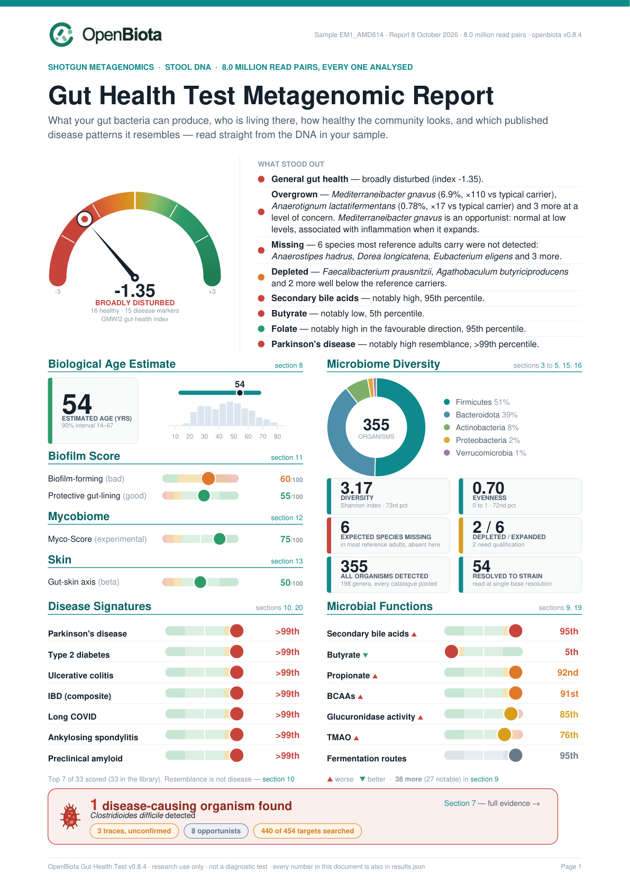
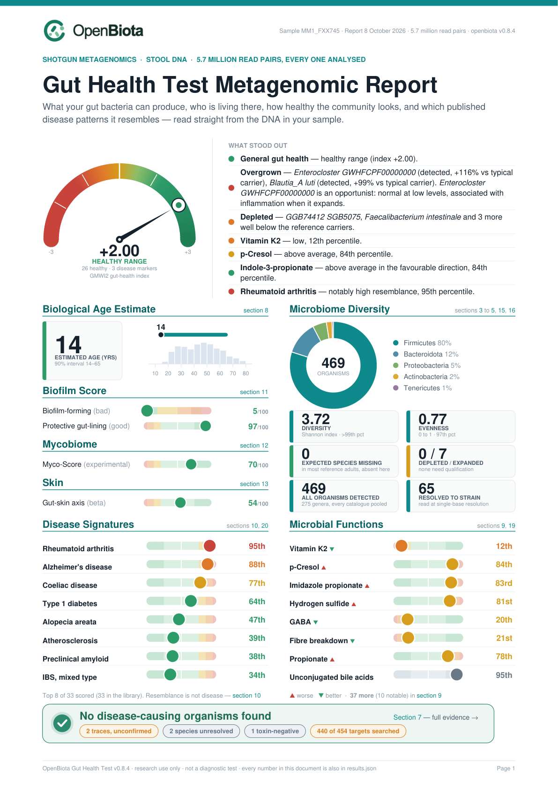
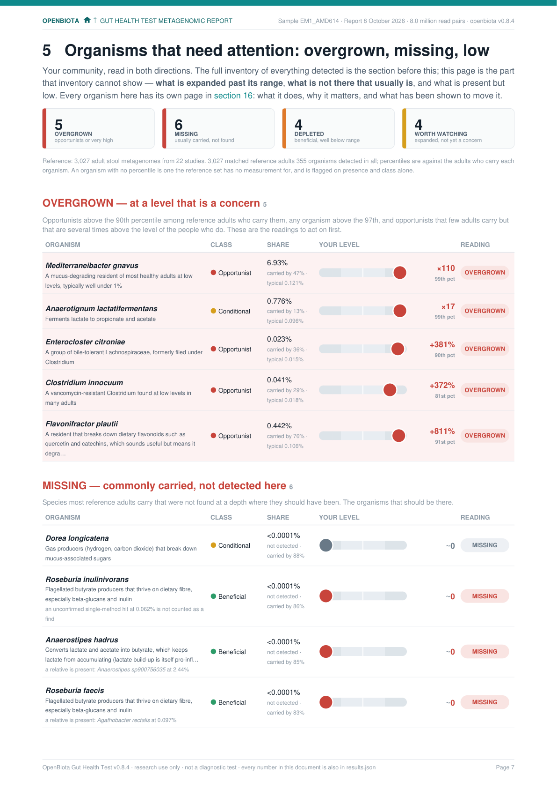
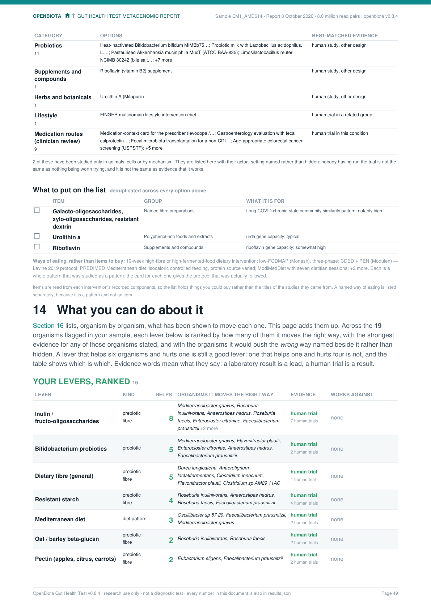
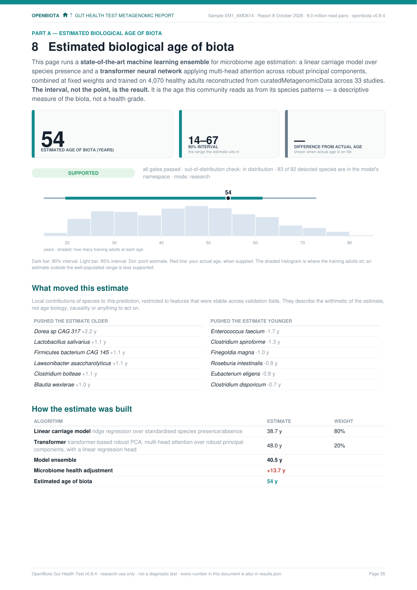
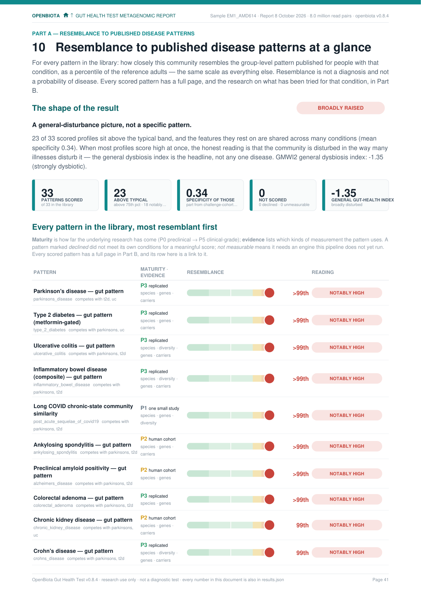

# OpenBiota Gut Health Test

**Input: Raw shotgun gene sequencing data (FASTQ files). Output: The world's most in-depth gut-health test report (PDF file).**

[](https://github.com/openbiota-org/openbiota-gut-health-test/actions/workflows/tests.yml)

[openbiota.com](https://openbiota.com) · [Documentation](https://openbiota.com/docs/) · [Quickstart](docs/QUICKSTART.md)

The OpenBiota software (`openbiota` on the command line) is a bioinformatics
pipeline that takes the multi-gigabyte paired-end FASTQ files behind a shotgun
stool metagenome and turns them — every single read, no sampling — into the
**OpenBiota Gut Health Test**: a gut-health index, species-level community
composition, copies-per-100-genomes capacity for 25 metabolite pathways,
resemblance scores against 33 published disease-associated microbiome patterns,
a 485-target pathogen screen and an estimated microbiome age. Page one is the
whole answer in graphics; the pages behind it are the evidence. Every number is
placed on **one shared seven-band scale** against thousands of reference
metagenomes, and every number traces back to the reads that produced it.

<p align="center">
  <a href="sample-reports/EM1_AMD614_report.pdf"></a>
  <a href="sample-reports/MM1_FXX745_report.pdf"></a>
</p>
<p align="center"><sub><b>Two sample reports from real samples</b>, produced by the same software: a community the index places as <a href="sample-reports/EM1_AMD614_report.pdf">broadly disturbed</a> (left) and one in the <a href="sample-reports/MM1_FXX745_report.pdf">healthy range</a> (right). Click either page to read the whole report.</sub></p>

```bash
brew install diamond bowtie2 && make setup
make run          # ./fastq → results/<sample>/<sample>_report.pdf
make run-all      # every sample in ./fastq, plus a side-by-side comparison
```

<p align="center">
  
  
  
  
</p>
<p align="center"><sub><b>Part A, at a glance:</b> summary · what stood out · validity and neutral community metrics · 25 functions · 10 microbial groups · organisms missing / low / high / unusual · every disease pattern · evidence overview · microbiome age. <b>Part B, in detail:</b> every reading broken down, with the human research on changing it under each one. Pages shown from the broadly disturbed report; the <a href="docs/images/mm1/">healthy-range pages</a> are in the documentation.</sub></p>

---

## Thank you, Tiny Health

This project exists because [**Tiny Health**](https://www.tinyhealth.com) does
something almost no consumer microbiome company does: **they give you your raw
data.** Their support and research teams sent over download links for the
multi-gigabyte FASTQ files behind every kit in this repository, answered
questions about the sequencing, and were generous with their time. Their own
report is excellent; this project is what you can build *on top of it* when a
lab hands you the reads instead of just a PDF.

If you want a gut microbiome test that is shotgun metagenomics rather than 16S,
processed in a CLIA-certified and CAP-accredited lab, with strain-level and
functional insight and a team that will actually send you your data —
**[get a Tiny Health gut test](https://www.tinyhealth.com/store)**. Then point
`openbiota` at the FASTQs.

---

## What it does

`openbiota` applies a set of bioinformatic analysis algorithms and methods directly
to the raw shotgun gene sequence data (FASTQ) from a stool sample. Two
independent measurement engines run on the same reads:

<table>
<tr><td width="50%">

**Part A — metabolite gene capacity**

Twenty-five pathways, sixty-one genes — SCFAs, neuroactive compounds (GABA,
dopamine, histamine, tryptamine), five vitamins, H2S and methane, detox enzymes,
CRC virulence factors. DIAMOND translated search of every read against curated
protein references, normalised by gene length and by `rpoB` — a gene every
bacterium carries exactly once — to give **copies per 100 bacterial genomes**.
No assembly, so low-abundance organisms still count. Sequencing depth cancels
out. Human DNA cancels out.

</td><td width="50%">

**Part B — community & disease patterns**

Host reads removed with Bowtie2, then MetaPhlAn species profiling, compared in
centred log-ratio space against **3,027 healthy adult stool metagenomes** from
22 studies. A published gut-health index (GMWI2, trained on 8,069 samples),
**33 disease-pattern profiles** with graded evidence and a shape analysis
across the whole library, eleven curated microbial groups, and every organism
with its level against the adults who carry it. Detection pools **nine
methods** over the largest current catalogues — MetaPhlAn 4 (72,000 species
bins), GlobDB r232 (346,000 genomes) by whole-genome sketch, mOTUs 4, two
Kraken 2 panels, SingleM, targeted assembly, competitive read mapping against
each candidate's relatives, and StrainPhlAn 4 placement — merged into one
organism list with one share of the whole per organism.

</td></tr>
</table>

**One scale, everywhere.** Every percentile in the report — metabolite, disease
pattern, module score — is translated to the same seven words: *notably low ·
low · below average · typical · above average · high · notably high*. Colour
carries the judgement (does the literature read that direction as favourable
or adverse), the word carries the position. You learn the bar once on page 2
and never need a legend again.

**Page one is the whole answer.** A gut-health dial, the things that stood
out — including which commonly carried species are *missing* — the notable
pathways on the scale, a community donut and the top disease-pattern bars with
the library-wide shape verdict. Sample ID, date and version live in the fine
print at the top-right corner where they belong.

**One account of what is present.** Nine detection methods over the current
reference catalogues give every organism a single share of the community, and
every other section is held to that account: the 485-target pathogen screen
has each bacterial call checked against it, so sequence an organism shares
with a relative that is present is reported as the relative's rather than as
a finding; sections ranked against a single reference catalogue keep that
catalogue's readings — that is what makes their percentiles mean anything —
and print the pooled reading beside a non-detection instead of contradicting
the organism list. A test suite asserts it, report by report.

**What is missing, not just what is there.** Every species the reference
adults commonly carry is checked against a depth-aware detection model, so a
non-detection is only called *missing* when the sequencing was deep enough to
have seen it. Detected species are placed among the reference carriers with a
study-block bootstrap; the report separates missing, depleted, expanded,
unusual and needs-qualification organisms, each with a curated, cited
interpretation.

**What the research says you can do about it.** Every reading that fires —
a function, a group, an organism, a disease pattern — is matched against a
registry of exact interventions (strain and dose as studied, diet protocols,
prescription drugs, FMT, clinical routes) with PICO evidence assertions for
and against, evidence lanes A–E/X, applicability to this sample, and a
fail-closed safety-rule engine. Where nothing has been shown to work, the card
says so. Nothing is a recommendation.

**Estimated microbiome age.** A clean-room retraining of the Myers et al.
2025 stool-WGS age predictor on 4,070 curatedMetagenomicData adults, validated
leave-one-study-out with conformal intervals and out-of-distribution
detection. The interval is the result, and the model card on the page says
how weak the cross-study signal is.

Batch mode screens every pair in the directory and compares them:

```
  GENERAL GUT HEALTH (GMWI2)
                            SAMPLE3      SAMPLE1      SAMPLE2      SAMPLE4      SAMPLE6
  ---------------------------------------------------------------------------------------
  index                          0.37        -0.20        -1.35         1.65         2.63
  band                        healthy    indeterm.  dysbiotic!!      healthy      healthy
  diversity (Shannon)            3.02         3.36         3.17         3.66         3.49

  METABOLITE PATHWAYS — percentile vs reference cohort
  bai                              35           32           95           45           45
  butyrate                         37           42           71           21           60
  urda                             86           95           30           64           79
  ...
  DISEASE-PATTERN SIMILARITY — percentile (resemblance, not diagnosis)
  crc                              65           87           23           50           23
  longcovid                        82           62           90           41           21
  mecfs                            59           13           72           40           59
```

Output per sample:

```
results/<sample>/
├── <sample>_report.pdf  the Gut Health Test Metagenomic Report: dashboard, organisms, functions, patterns, evidence, validation
├── summary.txt          the same content as text, one section per subject
├── results.json         every number, machine-readable, with all five version IDs
├── run.log              tool versions, flags, timings, reference fingerprints
├── depth_check.json     rarefaction — was the sequencing deep enough?
├── taxonomy/            species profile + cached alignment
└── alignments/          raw and per-panel DIAMOND hits
```

---

## Why this exists

Consumer microbiome tests hand you a pie chart and a wellness score. Published
metagenomics pipelines hand you a TSV and a citation. This sits in between: the
statistical care of the second with the readability of the first, and — the part
most tools skip — **an honest account of what it cannot tell you**, kept in the
fine print where it doesn't get in the way of the result.

Three things it does that comparable tools generally don't:

**It refuses to answer when it shouldn't.** Recent antibiotics, thin coverage,
missing metadata, or a reference group too small to rank against, and the engine
abstains and prints what would need to change. A refused score beats a confident
wrong one.

**It checks itself with two independent measurements.** Species abundance says
butyrate producers are depleted; a direct gene search says butyrate capacity is
normal. Both are printed, the disagreement is flagged, and it goes on the front
page. On the sample above they *do* disagree — and that's the most interesting
thing in the report.

**It publishes the number that makes it look bad.** The colorectal-cancer
pattern separates inflammatory bowel disease (AUC 0.76) *better* than the cancer
it was built for (0.62). That's in the report, in the fine print of the page,
next to the score. Most of these published patterns are general-dysbiosis
signals wearing a disease label, and the specificity matrix is how you find out.

---

## Measured, not asserted

Every figure here comes from `make validate` and `make validate-profiles`, and
both write their raw output to `docs/`.

| | |
|---|---|
| Gene detection sensitivity | **97.0%** |
| Gene detection specificity | **100.0%** — zero false positives in 62 true negatives |
| Detection limit | carriers found down to **0.2% of cells** |
| Quantitative calibration | slope 1.13, R² 0.72 |
| CRC pattern, labelled cohorts | **AUC 0.62** (95% CI 0.57–0.67), n=258 cases |
| Reference cohort | 3,027 samples, 22 studies, median depth 38.2M reads |

Sensitivity and specificity come from synthetic communities built from real
genomes, where the answer is known in advance. The CRC AUC comes from
curatedMetagenomicData cohorts that carry disease labels — the only part of this
that can be tested against clinical ground truth, which is exactly why it ships
as a validation control rather than as a health readout.

**Cross-profile specificity matrix** — the most informative table the project
produces:

| Profile | vs CRC | vs IBD | vs T2D |
|---|---|---|---|
| `crc` | **0.62** | 0.76 | 0.52 |
| `longcovid` | 0.53 | 0.80 | 0.59 |
| `mecfs` | 0.56 | 0.49 | 0.60 |

A profile should score highest against its own condition. Two of these don't,
and one has no labelled cohort to score against at all. That is reported rather
than smoothed over — see [docs/VALIDATION.md](docs/VALIDATION.md).

---

## Bugs worth reading about

Both of these produced plausible-looking numbers, which is what made them worth
chasing. Both are now regression tests.

**A depth-dependent zero floor.** Relative abundances need zeros replaced before
taking logs, and the textbook rule is "half the smallest observed value". That
makes the floor depend on the sample: a deeper library detects rarer taxa, gets
a lower floor, and maps its zeros further down than a shallow one. For a taxon
absent in most samples, *that difference is the entire signal*. Now a fixed
constant.

**Absence treated as a number.** Even with a fixed floor, two samples that both
lack a taxon get different CLR values, because the transform carries a
geometric-mean denominator that varies with how many other taxa each sample
happened to detect. Comparing those values compares sequencing incidentals. It
placed five *absent* colorectal markers at the 74th percentile and produced a
74th-percentile cancer-pattern score for a sample carrying none of them.
Absence is now a category: 48th percentile, and the score dropped to 23rd.

---

## Commands

```bash
openbiota run                          # screen ./fastq
openbiota run-all                      # every sample, plus comparison.json
openbiota run --subsample 100000       # 17-second smoke test
openbiota run --compact                # one-screen answer
openbiota run --no-profiles            # Part A only, no MetaPhlAn needed
openbiota run --trim                   # let fastp trim adapters and write the reads it uses
openbiota run --no-extended-catalogue  # skip the MetaPhlAn 4 SGB inventory
openbiota run --include-opt-in         # also score profiles marked opt-in (none ship marked)

openbiota run --subject-country USA --subject-age 46 --subject-sex male
openbiota run --illness-duration-years 12    # picks the duration stratum

openbiota panels                       # list the 25 gene panels

openbiota fmt match --recipient results/R --donor A=results/A --out results/fmt   # donor matching
openbiota profiles                     # the 30-profile library with maturity grades
openbiota profiles --show mecfs        # one disease profile, all weight factors
openbiota doctor                       # check dependencies and inputs
openbiota depth-check                  # was the sequencing deep enough?
```

One-time reference builds, all cached and idempotent:

```bash
make build-db           # ~16 min  protein references from UniProt
make cohort             # ~10 min  percentile ranges for Part A
make taxonomic-cohort   # ~8 min   3,027-sample species cohort
make host-index         # ~40 min  GRCh38 + PhiX for host removal
make validate           # ~5 min   sensitivity, specificity, calibration
make validate-profiles  # ~2 min   AUCs on labelled cohorts
make all                # the lot, in order, then run
```

---

## How it works

**Part A, in four steps**

1. `diamond blastx` searches reads directly against curated protein references.
   No assembly.
2. Decoy sequences for every close homolog sit in the same database. A read
   counts only when its best hit across everything is a real target.
3. Counts are divided by gene length and by `rpoB`, giving copies per genome.
4. Active-site residue checks filter hits that align but can't catalyse.

**Part B, in four more**

1. Human reads removed with Bowtie2 against GRCh38 + PhiX. Part A needs no host
   removal — human DNA cancels in the `rpoB` ratio — but this half does.
2. MetaPhlAn 3 identifies species from marker genes, pinned to the same database
   version the reference cohort was built with. Species abundances from
   different profiler versions are not comparable, and the tool refuses to mix
   them.
3. Abundances compared in CLR space against the median and MAD of a
   country/age/sex-matched stratum. Robust statistics, because one outlier must
   not set the scale.
4. Each feature carries an explicit evidence type (shotgun species, 16S genus
   with a declared transport, gene family, ecological index, carrier set) and
   a claim level; independent studies are fused as separate modules. A
   non-multiplicative confidence vector, a bootstrap interval and a library-
   wide shape analysis (is one pattern standing out, or is everything high?)
   travel with every score. Percentiles come from scoring every reference
   sample the same way, never from rescaling.

**Organisms, in five more**

1. Nine detection methods run on the same host-filtered reads, each against its
   own catalogue: MetaPhlAn 4 (Jan26), GlobDB r232 by sylph, mOTUs 4, Kraken 2
   against UHGG v2 and against a locally built gut rescue panel, SingleM, and
   targeted assembly of the reads no method could place.
2. Their calls are merged into one inventory through release-aware crosswalks
   to GTDB R232: one organism under two catalogues' names is one record, and a
   catalogue's label that names a different species is kept as a record, not as
   a name the organism answers to.
3. Every call the installed baseline never saw, and every call resting on one
   method, competes for the sample's reads against its detected relatives by
   whole-genome mapping. A call whose reads map better to a relative is
   rejected; one that recruits many independent fragments across its genome at
   species-level identity is supported.
4. Every organism gets one share of the whole on the composition's scale: a
   marker species that the mapping shows to be several populations is divided
   among them; an organism the marker catalogue has no entry for takes its
   whole-genome reading, rescaled, from the unclassified band.
5. Each organism's level is stated against reference adults who carry it — the
   deviation from the typical carrier and the rank among carriers, on the same
   distribution, so the two always agree — and its dominant strain is placed
   among the reference genomes of its species with StrainPhlAn 4.

[docs/METHOD.md](docs/METHOD.md) has the reasoning behind each choice;
[docs/EXPANDED_DETECTION.md](docs/EXPANDED_DETECTION.md) covers the detection
lanes, crosswalks, confirmation and measured capability.

---

## Pathways and profiles

Twenty-five gene panels in six groups — `openbiota panels` lists them with their
genes, [docs/PANELS.md](docs/PANELS.md) explains each and what was left out
(serotonin has no bacterial gene to count; the panels cover the levers that
move it instead).

| Group | Panels |
|---|---|
| Metabolite capacity | `butyrate` `propionate` `bcaa` `cutc` `urda` `bai` `bsh` `indole` `ipa` `pcresol` |
| Neuroactive | `gaba` `dopamine` `histamine` `tryptamine` |
| Vitamins | `b12` `k2` `folate` `riboflavin` `biotin` |
| Gases | `h2s` `methane` |
| Detox / breakdown | `bglucuronidase` `oxalate` `urease` |
| Toxins / virulence | `crc_virulence` |

Thirty disease-pattern profiles, each graded by evidence maturity and each a
statement of *resemblance*, never diagnosis:

| Maturity | Profiles |
|---|---|
| P3 — multi-cohort, meta-analysed | `crc` `adenoma` `crohns` `uc` `ibd` `t2d` `cirrhosis` `parkinsons` `ms` `acvd` `ra` `obesity` |
| P2 — replicated, smaller cohorts | `masld` `t1d` `celiac` `ankylosing_spondylitis` `hypertension` `ckd` `ibs` `ad_clinical` `ad_mci` `ad_preclinical_amyloid` `mecfs` `mdd` (opt-in) |
| P1 — single-cohort or 16S-only | `ibs_c` `ibs_d` `ibs_m` `alopecia_areata` `androgenetic_alopecia` `longcovid` |

`crc` doubles as the validation control (own-condition AUC 0.62, 0.57–0.67);
the shape analysis reports how many of the 30 a sample resembles at once,
because a sample that looks like everything looks like nothing in particular.

Both are config, not code. A pathway is a YAML file
([docs/PANELS.md](docs/PANELS.md)); so is a profile
([docs/PROFILES.md](docs/PROFILES.md)); so is a microbial group (`taxa/`). The
loader refuses shotgun-derived genus-level features outright, and accepts a
16S-derived genus only with a declared transport and, for the seven genera
whose direction flips between cohorts (*Faecalibacterium*, *Streptococcus*,
*Blautia*, …), an explicit direction-conflict flag.

---

## Design notes

**Gene-name queries are a trap.** `gene:cutC` in UniProt returns ~6,300
entries, overwhelmingly the *copper homeostasis* protein CutC, unrelated to
choline metabolism. `gene:clbA` returns catfish MHC class I chains. `gene:bft`
returns human pituitary homeobox 1. Every panel query matches on protein name
with an explicit comment recording what the naive version returns.

**Two panels are deliberately absent.** The spec calls for `clbB` (colibactin)
and `bft` panels. UniProt yields 13 and 9 usable references spanning
82–3,206 aa, against 300–2,000 for every shipped panel. At that size panel
sensitivity isn't low, it's *unmeasurable* — and a panel reporting `0.0` with
unknown sensitivity is indistinguishable from one that works. The reasoning is
in `profiles/crc.yaml` rather than in a commit message.

**Inputs stay compressed.** 600 MB gzipped against 2.6 GB plain, and every
consumer reads gzip natively. Where a full pass is needed, streaming through
the system `gzip -dc` beats Python's `gzip` module ~5× (3.9 s vs 19.8 s per
mate). `pigz` was measured and is *slower* — a single gzip stream can't be
inflated in parallel. Nothing is ever decompressed to a file.

---

## Requirements

Python 3.11+, DIAMOND 2.x, Bowtie2, ~30 GB for the core reference data
(`make setup`, `make build-db`, `make cohort`).

For Part B: MetaPhlAn 3 in its own environment —

```bash
python3 -m venv .venv-mpa3 && .venv-mpa3/bin/pip install 'metaphlan==3.1.0'
```

Version 3 specifically, because that is what the reference cohort and the
GMWI2 index were built with. `openbiota run --no-profiles` skips all of it.

For the full organism detection (nine methods, competitive confirmation,
strain placement): `make tools-expanded` installs every pinned tool and
`make refs-expanded` fetches and verifies every reference release; together
they need about 1.3 TB of disk, most of it the GlobDB r232 genome archive
(`make refs-globdb-genomes`). Every tool version and every reference file is
locked with its checksum under `refs/expanded/`, and `refs/MANIFEST.md`
lists what is on disk and how to rebuild it. A run without these installed
still produces the report from the core lanes and says which methods did not
run.

About 2,500 tests, `make test`. No network access in the test suite.

---

## Scope

Gene capacity is **which metabolite-producing genes are present and how
abundant** — not metabolite concentrations. Pattern resemblance is
**resemblance to a group-level published pattern** — not a diagnosis, not a
probability of disease.

This is not a diagnostic test, and no threshold in any output corresponds to a
clinical decision, because none has been published for any of these pathways.

---

## Documentation

| | |
|---|---|
| [docs/METHOD.md](docs/METHOD.md) | How the measurement works, and why each choice was made |
| [docs/VALIDATION.md](docs/VALIDATION.md) | Measured accuracy, reference cohorts, every limitation |
| [docs/PANELS.md](docs/PANELS.md) | Pathway reference, adding a pathway, excluded genes |
| [docs/PROFILES.md](docs/PROFILES.md) | Disease profiles, the scoring engine, adding a profile |
| [docs/OUTPUT.md](docs/OUTPUT.md) | Reading the output, every field explained |
| [docs/USAGE.md](docs/USAGE.md) | Every CLI flag, caching, performance tuning |
| [docs/INSTALL.md](docs/INSTALL.md) | Installation, including non-macOS |
| [docs/EXPANDED_DETECTION.md](docs/EXPANDED_DETECTION.md) | The nine detection methods, crosswalks, confirmation, one share per organism, level against the reference |
| [docs/MEASURED_CAPABILITY.md](docs/MEASURED_CAPABILITY.md) | What the detection measured on simulated communities with known composition, against the targets it was built to |
| [docs/FMT.md](docs/FMT.md) | Donor matching for faecal microbiota transplant, from the same results files |
| [docs/TESTING.md](docs/TESTING.md) | Test suite and development |
| [docs/ATTRIBUTION.md](docs/ATTRIBUTION.md) | Every tool and reference release the report is built on, with its licence |

## Credits

Raw sequencing data courtesy of [Tiny Health](https://www.tinyhealth.com) and
their support and research teams — [buy a kit](https://www.tinyhealth.com/store),
ask for your FASTQs.

Built on [DIAMOND](https://github.com/bbuchfink/diamond),
[MetaPhlAn](https://github.com/biobakery/MetaPhlAn),
[Bowtie2](https://github.com/BenLangmead/bowtie2),
[curatedMetagenomicData](https://waldronlab.io/curatedMetagenomicData/) and
[GMWI2](https://github.com/danielchang2002/GMWI2). Reference proteins from
UniProt. Full citations, with working links, in the docs and in every panel and
profile definition.

## Licence

Free for any **noncommercial** purpose — personal use, research, education,
charities, public-health and government institutions — under the
[PolyForm Noncommercial License 1.0.0](LICENSE). Commercial use of any kind
requires a commercial licence from OpenBiota; enquire via
[openbiota.com](https://openbiota.com). Contributions are accepted under the
same terms.
