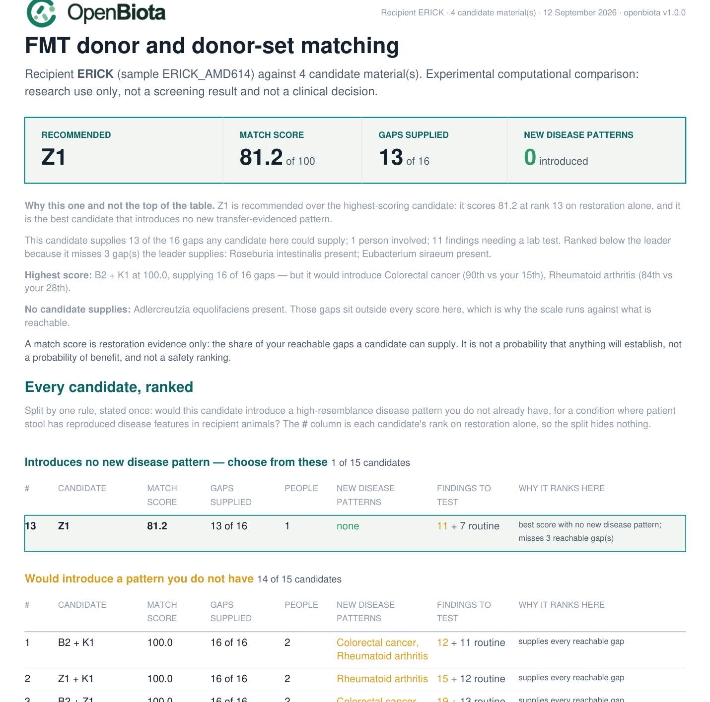

<p class="eyebrow">Research tool</p>

# FMT donor matching

`openbiota fmt match` compares one recipient against any number of candidate
donor materials, evaluates combinations of donors for complementary
restoration potential, and writes a report that separates what was measured
from what was predicted, simulated or left unresolved.

!!! warning "What this command is not"

    It is an **experimental computational comparison**. It does not screen a
    donor, clear a donor, predict clinical benefit, or produce preparation,
    mixing, dosing or administration instructions. There is deliberately no
    `safe` field, no clearance probability and no "approved for FMT" state
    anywhere in the output. Whether any material is ever used is a decision
    for a responsible clinical or research programme with validated
    laboratory screening — not for this software.

## Run it

```bash
openbiota fmt match \
  --recipient results/SAMPLE2_A02 \
  --donor SAMPLE3=results/SAMPLE3_A03 \
  --donor SAMPLE4=results/SAMPLE4_A04 \
  --donor SAMPLE6=results/SAMPLE6_A06 \
  --donor SAMPLE1=results/SAMPLE1_A01 \
  --indication longcovid \
  --out results/fmt_SAMPLE2_vs_4donors
```

Every input is a sample output directory from `openbiota run`. The command
reads the native `results.json` of each one; it never needs the network, and
it never reprocesses reads.

Outputs land in `--out`: `match.json` (canonical), `match.html`, `match.pdf`
and `provenance.json`. The HTML and PDF read the JSON only, so the three can
never disagree.

| Subcommand | What it does |
|---|---|
| `fmt match` | run a comparison and write the reports |
| `fmt inspect --manifest req.json` | validate a request and list what would be used |
| `fmt explain --run DIR --candidate SAMPLE4+SAMPLE6` | what one candidate uniquely supplies |
| `fmt validate --run DIR` | check a completed run's integrity |
| `fmt models list` | capability and model-artifact status |

Useful flags: `--max-donors-per-set`, `--max-materials-per-set`,
`--max-subsets`, `--goals FILE`, `--screening-manifest FILE`, `--formats`,
`--objective`, `--seed`.

## What the report looks like

The first page is a leaderboard: the recommended candidate, then every other
candidate ranked, then a definition of each column — so "which donor is the
best match" has exactly one answer and the reason for the order is on the same
page.



## Why the recommendation is not simply the top score

The highest-scoring candidate is not always the one the report recommends, and
the gap between those two answers is the point of this section.

A match score measures restoration: how much of what the recipient is missing a
candidate can supply. It says nothing about what a candidate would *add*. For
most donor differences that is fine — a resemblance percentile is not a
diagnosis, and a gut community is not a transmissible disease.

But for a small set of conditions, that dismissal does not hold up. Stool from
patients has been put into animals and reproduced disease features against
healthy-donor controls. Colorectal cancer is the clearest case, with four
independent studies: promotion of intestinal carcinogenesis, accelerated
adenoma progression and oncogenic epigenetic signatures. A candidate at the 90th
percentile of that pattern, offered to a recipient at the 15th, is a different
proposition from one that merely shares a pattern the recipient already
carries.

So the report applies one rule, stated on the page:

> **Recommended** = the highest-scoring candidate that would introduce no new
> high-resemblance disease pattern whose condition has human-donor transfer
> evidence.

A pattern counts as **introduced** when the candidate sits at or above the
**75th percentile** and at least **20 percentile points above** the recipient's
own reading. A pattern the recipient already carries at a similar level is not
counted — it is not new to them.

A pattern counts as **transfer-evidenced** only when patient stool produced
disease features in a recipient animal against healthy-donor controls. Conditions
resting on association alone — coeliac disease, ME/CFS, alopecia areata,
androgenetic alopecia — are reported but never block a candidate. The tiers and
their citations come from `specs/research/Disease_Evidence.md`, including its
explicit boundary list of conditions where association must not be relabelled as
transfer.

Nothing is hidden by this rule:

* Every candidate keeps its score and its rank on restoration alone; the `#`
  column is that rank.
* The ranked table is **split**, not filtered, under two headings: candidates
  that introduce nothing new, and candidates that would introduce something.
* The highest-scoring candidate is named on the first page either way, with the
  patterns it would introduce spelled out.
* A dedicated section lists every flagged pattern with the donor's percentile,
  the recipient's, the strongest published transfer experiment, its limit and
  its citations.
* If no candidate is clean, the report says so rather than inventing a
  recommendation.

This stays out of the benefit score on purpose. A hazard and a benefit are not
commensurable, and averaging them into one number would hide exactly the
decision a person needs to make. Every transfer experiment behind these tiers
used an animal, usually a predisposed or chemically sensitised one, and none
establishes that a human FMT transmits a disease. The rule exists because "do
not give me a condition I do not already have" is a reasonable thing to ask of
a donor choice, not because the risk is quantified.

## What the number means

**Match score, 0–100.** The share of the recipient's *reachable* gaps a
candidate supplies — each gap counted once, with partial credit where supply is
graded. "Reachable" means a gap that at least one of the supplied materials can
supply at all: gaps nobody covers are named separately and kept out of the
scale, so **100 means "supplies everything these materials could supply between
them"** rather than an unreachable ideal.

The leaderboard ranks on that score, then on how many gaps are *fully* rather
than partly supplied, then on the fewest people involved, then on the fewest
findings needing a laboratory test, then on a stable candidate ID. Findings are
a **tie-break only** — they are never traded against the score, and no candidate
is promoted for having fewer of them.

It is not a percentage of a microbiome restored, not an engraftment probability,
not a probability of clinical benefit and not a safety ranking.

**Supported target coverage, 0–100.** The same evidence as a group-capped
index, reported beside the match score. Gaps are grouped so that one biological
signal cannot be counted twice: a curated guild and the gene panel measuring the
same capacity share a group, and their combined credit is capped at that group's
weight.

The arithmetic is deliberately conservative:

* The **denominator is frozen** across every candidate. A donor measured on
  fewer features cannot score well by having fewer goals.
* An **unassessed** target contributes nothing to the supported figure while
  keeping its measurement `null` and its scenario bounds at `[0, 1]`. No
  evidence earns no credit — and no evidence is not proof of absence.
* An **assessed non-detection** contributes nothing and narrows to zero, with
  the assay's uncalibrated detection limit recorded as an uncertainty reason.
* Supply is **capped at 1 per target**, so excess earns nothing.
* **One signal, one vote.** A curated guild and the gene panel measuring the
  same capacity share a counting group, and their combined credit is capped at
  that group's weight. Ten butyrate taxa cannot multiply butyrate's
  importance tenfold.

The interval beside a coverage figure is a **scenario bound**, not a
confidence interval: it is the range across analytical uncertainty (trace
calls, unassessed features), not a statistical statement.

## The target ledger

Goals are built **once, from the recipient alone**, before any donor is
examined — otherwise adding a donor could change what the recipient is said
to need. Four origins stay separate:

| Origin | Where it comes from |
|---|---|
| `reference_supported` | a curated guild member absent from the recipient but common in the reference cohort, or a feature reading below the reference lower quartile |
| `indication_hypothesis` | a feature the recipient's own scored disease pattern reports as depleted in that condition, carrying its study module as the source |
| `explicit_user_goal` | anything you ask for in `--goals`, allowed without trial evidence and labelled as such |
| `report_candidate` | context only: descriptors, community indices, disease-pattern percentiles, uncurated polarity |

Neutral and unknown-polarity features are context by default. A high feature
becomes an avoidance goal only when its adverse direction is sourced, and a
donor lacking a feature never earns "eradication" credit — there is no
negative abundance credit in the tool.

## Donor sets

Set identity is the sorted member list, so `SAMPLE4+SAMPLE6` and `SAMPLE6+SAMPLE4` are one
candidate. Both `material_count` and `unique_donor_count` are tracked, so two
samples from one person are never two donors.

A set's coverage is an **availability ceiling**: at least one member has
evidence of supplying the goal. It is not a pooled concentration, a predicted
community or a persistence forecast. Adding relative abundances does not model
viability, competition, resource sharing or priority effects, and concatenated
FASTQs are not a sequenced physical pool.

Every candidate is compared on a common objective vector — lower scenario
coverage, supported coverage and assessed goal weight (maximise); scenario
width, unique donor count and material count (minimise) — and Pareto fronts
are reported with a deterministic display order. Hazards are deliberately
**not** in that vector: they are shown alongside, never traded against
benefit.

## Concerns and exclusions

Only **confirmed, material-linked** evidence can exclude material: rules X01
(a qualifying transmissible pathogen), X02 (confirmed ESBL/CRE/VRE/MRSA), X03
(identity or integrity failure — which excludes the *record*, never the
person) and X04 (a documented programme criterion). Those require a
`--screening-manifest` with validated laboratory results.

Everything the sequencing itself finds is a review item, tiered by analytical
strength rather than by how alarming the organism's name is:

| Tier | Meaning |
|---|---|
| `high_consequence_supported` | organism-specific fragments across several informative regions for an established enteric pathogen |
| `high_consequence_unresolved` | a serious organism with support confined to one region, or otherwise ambiguous identity |
| `technical_ambiguity` | no organism-specific fragment at all — only fragments shared with other taxa |
| `toxin_or_resistance_review` | a determinant with no resolved carrier, intact allele or phenotype |
| `screening_gap` | no validated screening record linked to the analysed donation |
| `context` | disease-pattern resemblance, background and decoy organisms |

The leaderboard splits findings into two columns, because they mean different
things to a reader. **Serious findings** are organisms that would matter if the
evidence held up and that a laboratory test would settle. **Other findings** are
the routine residue every stool sample produces: a species a close relative
makes unnameable, an organism carried without the genes that cause disease, a
resistance gene with no resolved carrier.

### "Needs a lab test" names the test and the material

A finding that says only "needs a laboratory test" is not actionable, and a
donor candidate is usually a banked, frozen aliquot rather than a person in a
clinic. So every finding states which test would settle it and what that test
needs:

| Route | What it runs on |
|---|---|
| stool nucleic-acid test (PCR panel) | a thawed aliquot of the banked sample, or a fresh sample from the donor |
| stool culture | viable organisms — run it on a fresh sample; a frozen aliquot may not grow even when the organism was there |
| toxin immunoassay (EIA) | the toxin protein, in a thawed aliquot or a fresh sample |
| stool antigen test | a thawed aliquot or a fresh sample |
| modified acid-fast microscopy | a preserved or thawed aliquot |

The routes come from each catalogue target's `confirmation_options`, so the
report never invents a test that does not apply to the organism it found.

### "Identity not confirmed" and the zero-fragment rule

**Serious organism, identity not confirmed** means the sequence matched an
organism but not well enough to name the species: either the support sits in a
region the organism shares with a close relative, or the organism is the same
genomic species as a relative most healthy guts carry. No species name is given
because it would be a guess, and nothing has been ruled in or out.

A row with **zero organism-specific fragments** has no evidence to resolve, so
it can never produce a "DNA present" line. Reporting *"Enteroinvasive
Escherichia coli — DNA present — 0 specific fragments, 0 regions"* is a sentence
that contradicts itself, and it was the most alarming-looking line in the report
for a row carrying nothing at all. Those rows now fall through to a plain
statement that only shared sequence matched. Two tests enforce this:
`test_no_finding_claims_dna_present_with_zero_specific_fragments` and
`test_every_finding_names_the_test_and_the_material`.

A gene-family resistance hit with no resolved carrier can only ever raise
R02 — never an MDRO call. A disease-pattern percentile can only ever be
context (C01). And the report says *"no confirmed exclusion identified in the
available evidence"*, never "no risk": stool DNA sequencing cannot cover
blood-borne viruses, RNA enteric viruses, culture phenotype, parasite
microscopy, *H. pylori* antigen, medical history or the viability of anything
in the material that would actually be used. That list is printed in every
report.

## What is not implemented, and why

`openbiota fmt models list` prints the honest status of every optional
extension with the exact artifacts that would unblock it. At the time of
writing: strain resolution needs a strain caller and retained alignments; the
public engraftment baseline needs the Schmidt 2022 strain objects and triad
mappings; the MOZAIC adapter needs trained weights the authors do not
distribute (and its exported metadata maps two participants to one run
accession, which stays quarantined); the Zhang metabolic replay needs R, the
committed RDS and AGORA archives the repository references but does not
bundle; MICOM is not installed; and no ex-vivo immune assay exists for any
recipient here. None of these blocks the core comparison, and none of them is
faked with a placeholder score.

No prospectively validated donor-selection algorithm for post-acute COVID or
ME/CFS was found in the reviewed evidence, so `clinical_matching_validation`
reports `not_established_in_retrieved_evidence`. That label does not suppress
the goal-relative comparison — it describes what the comparison can and
cannot claim.

## Strain-level donor comparison

Species availability tells you a donor carries an organism you are missing.
Strain comparison tells you something availability cannot: whether a donor's
population of an organism you *both* carry is actually **different** from
yours. Where it differs, that organism is a candidate for changing something.
Where it is indistinguishable, it would add nothing you do not already have.

Spec §10.1 requires three capabilities kept strictly apart, because merging
them turns a comparison into a promise:

| Capability | Needs | Status without it |
|---|---|---|
| **Baseline comparison** — how related are the populations now? | The specimens in hand | Computed |
| **Observed engraftment** — did the donor's population establish? | A dated recipient follow-up specimen | `followup_required`, never "no engraftment" and never zero |
| **Prospective prediction** — will it establish? | A frozen, evaluated model | `model_unavailable`; the baseline comparison stands on its own |

`match_score` keeps its original meaning — **target availability and
complementarity**. It is not renamed to a probability of establishment when
strain results are added, and phylogenetic distance is never converted into a
probability.

### Reading the comparison

Only positions callable in *both* specimens are compared, and the count is
always reported. A comparison below 5,000 shared callable bases returns
`insufficient_callable_overlap` rather than a distance: zero differences across
200 positions means something entirely different from zero across 200,000.

### Disease resemblance no longer excludes a donor

The rule that a donor percentile ≥75, ≥20 points above the recipient, plus any
animal-transfer paper for that disease, marked a donor as introducing a
transferable causal pattern **has been retired** (§8.4).

It was wrong. A percentile is resemblance to a case-control *community
pattern*: it is not a feature of the donor, so there is nothing there to
transfer, and a paper about a disease says nothing about whether this donor
carries what the paper studied. In the supplied samples the rule blocked a
donor on a colorectal-cancer resemblance score whose actual measured colibactin
evidence was a single `clbB` fragment — not an intact island by any standard.

What replaces it is a **measured-mechanism ledger**: candidate mechanisms
counted only where the sequence evidence was measured in that donor, reported
per person and never pooled. A gene-family fragment count is the weakest
evidence there is, and each row states what a confirmed call would require —
subtype discrimination, locus architecture, gene integrity and carrier linkage.
