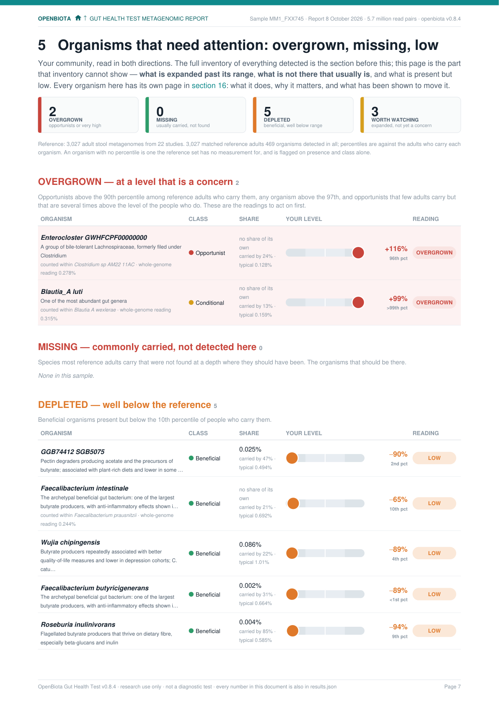
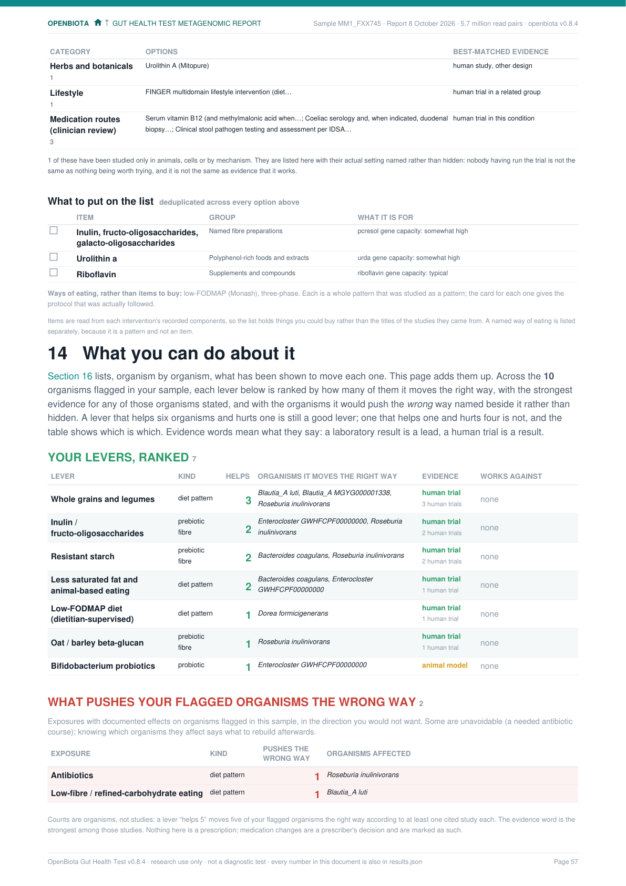
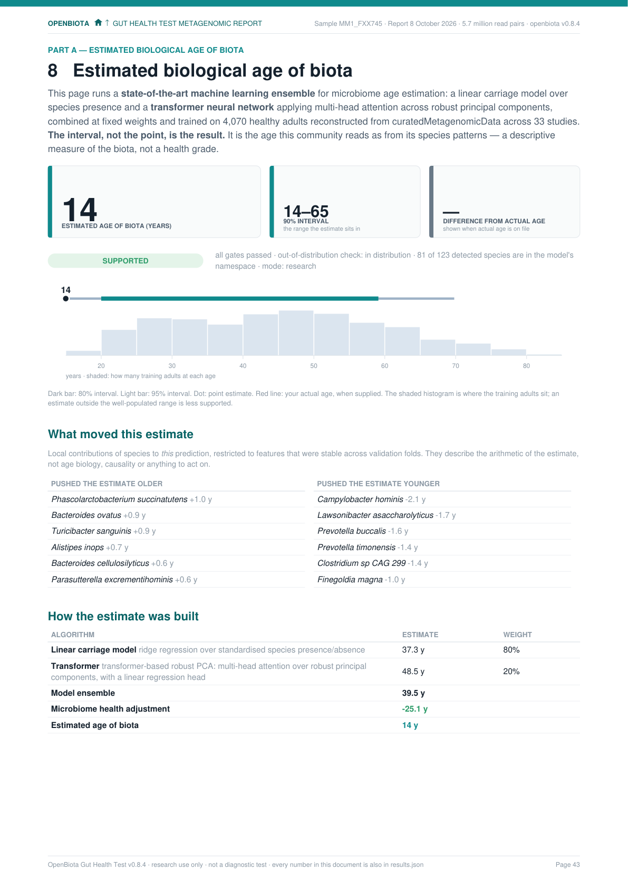
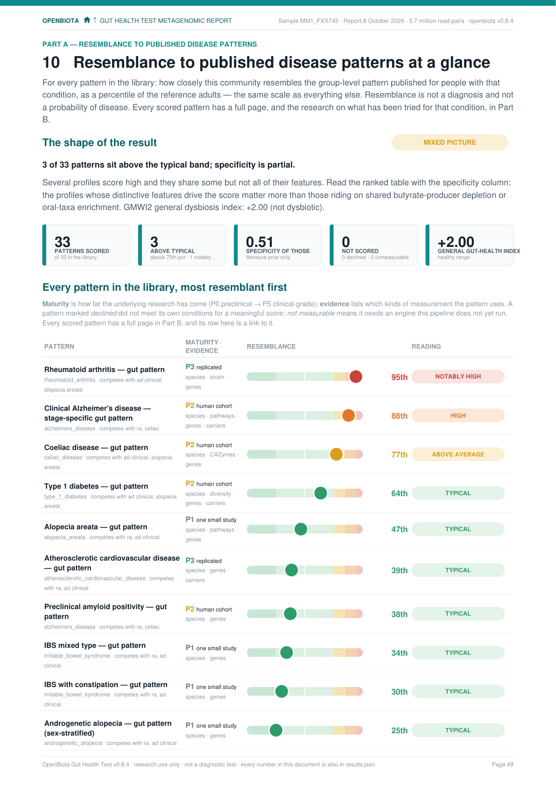

Documentation

# OpenBiota Gut Health Test

**Raw shotgun sequencing reads in. A gut-health report you can actually read out.**

The OpenBiota software (`openbiota` on the command line) takes the paired-end
FASTQ files behind a shotgun stool metagenome and turns them — every read, no
subsampling — into the OpenBiota Gut Health Test: a gut-health index,
species-level community composition, copies-per-100-genomes capacity for 25
metabolite pathways, resemblance scores against 33 published disease-associated
microbiome patterns, a 485-target pathogen screen and an estimated microbiome
age. Page one is the whole answer in graphics; the pages behind it are the
evidence, and every number traces back to the reads that produced it.

## Two sample reports

Two complete reports from real samples ship with the project, so you can read
one before sequencing anything. The same software produced both; the two
communities sit at opposite ends of the scale.

<figure markdown>
  [{ width="360" }](https://raw.githubusercontent.com/openbiota-org/openbiota-gut-health-test/main/sample-reports/EM1_AMD614_report.pdf)
  <figcaption><strong>Broadly disturbed.</strong> Index −1.35: an opportunist overgrown at ×110 its typical carrier, six core species missing, butyrate at the 5th percentile. <a href="https://raw.githubusercontent.com/openbiota-org/openbiota-gut-health-test/main/sample-reports/EM1_AMD614_report.pdf">Download the full report (PDF, 2.1 MB)</a></figcaption>
</figure>

<figure markdown>
  [{ width="360" }](https://raw.githubusercontent.com/openbiota-org/openbiota-gut-health-test/main/sample-reports/MM1_FXX745_report.pdf)
  <figcaption><strong>Healthy range.</strong> Index +2.00: 26 health markers to 3 disease markers, a protective gut lining at 97/100, two organisms modestly above their typical carrier. <a href="https://raw.githubusercontent.com/openbiota-org/openbiota-gut-health-test/main/sample-reports/MM1_FXX745_report.pdf">Download the full report (PDF, 1.9 MB)</a></figcaption>
</figure>

Page 1 is the whole answer in graphics: the gut-health dial, what stood out,
every metabolite pathway on one shared scale, the community donut and
disease-pattern resemblance. Behind it, the same pages for each report:

  
  
  
  

<small><strong>Broadly disturbed:</strong> organisms that need attention · what you can do about it · estimated age · disease patterns</small>

  
  
  
  

<small><strong>Healthy range:</strong> the same four pages</small>

!!! note "Research use only"
    The report measures *genetic capacity* and *community resemblance*. It does
    not measure metabolites and it does not diagnose disease. A match to a
    disease signature is a clue for further investigation, not a diagnosis.

## Where to start

-   **[Quickstart](QUICKSTART.md)**

    From a fresh clone to your first PDF: tools, reference data, one command.

-   **[Installation](INSTALL.md)**

    macOS and Linux, the two MetaPhlAn environments, verifying the install.

-   **[Usage](USAGE.md)**

    Every `openbiota` command and flag, caching, performance tuning.

-   **[Reading the report](OUTPUT.md)**

    What each section means, the seven-band scale, `results.json`.

-   **[Method](METHOD.md)**

    How the measurements are made and why they are made that way.

-   **[Validation](VALIDATION.md)**

    Sensitivity, specificity, the reference cohort, and a like-for-like
    comparison against a commercial report.

-   **[Organism detection](EXPANDED_DETECTION.md)**

    Nine detection methods over the largest current catalogues, merged into
    one organism list with one share of the whole per organism, competitive
    confirmation and strain placement.

-   **[Measured capability](MEASURED_CAPABILITY.md)**

    What the detection found on simulated communities with known composition,
    against the targets it was built to; stated as measured, not as claimed.

## The project

OpenBiota is free for any noncommercial purpose under the
[PolyForm Noncommercial License 1.0.0](https://polyformproject.org/licenses/noncommercial/1.0.0);
commercial use requires a licence from OpenBiota. The website is
<a href="../index.html">openbiota.com</a>; the code lives on
[GitHub](https://github.com/openbiota-org/openbiota-gut-health-test). Add a
published study, improve an analysis, or make a finding easier to understand —
every contribution brings more of the world's microbiome research into a report
anyone can generate.
