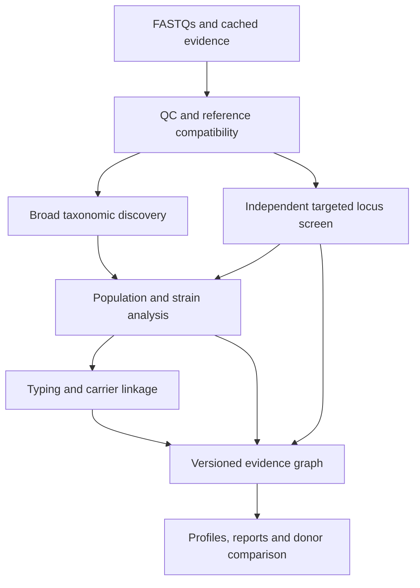

# OpenBiota — comprehensive strain, subtype and genomic-function implementation specification

**Research cutoff:** 16 September 2026. **Deliverable:** one complete coding-agent handoff. **Scope:** the entire analysis pipeline, every disease/functional/organism profile, intervention evidence, reports, exports, longitudinal comparisons and FMT donor matching. This specification incorporates the necessary RA repair; no separate source ledger or prior specification is required to implement this change.

**Revision 1.1:** incorporates the implementing agent's inventory of retained inputs for all five samples, the known missing SAM files, and the existing blocked engraftment module. Adds an explicit additive migration and separates baseline comparison, observed engraftment, predictive models and carrier attribution.

## 1. Required outcome

OpenBiota must attempt the most informative supported characterization of every detected organism and every prespecified medically or functionally relevant target. Species profiling remains useful, but cannot serve as the only representation of microbial identity. Implement taxonomic lineages, species/subspecies, population fingerprints, multiple conspecific strains, reference-related strain assignments, organism-specific typing schemes, and genomic traits as first-class data.

The required behavior is **analyze, preserve and expose the available resolution**. A missing strain engine is a software gap to fix, not a permanent reason to leave a disease's strain module unbound. An organism without a curated disease label still belongs in the inventory. A profile with unresolved strain evidence remains visible with its measured components and specific unresolved questions.

The software must also distinguish what the sequence supports. A closest reference is not automatically the identical cultured strain; two unlinked genes in one stool specimen are not automatically in one organism; serotype, pathotype and biotype are not a universal hierarchy below species. Morphology, expressed toxin, viability and measured metabolite concentration generally require information beyond DNA. Encode these distinctions in the result schema rather than hiding available findings or inventing precision.

**Completion means functional integration, not a database directory or a renamed report label.** Against the supplied repository and FASTQs, the implementation must analyze the original SAMPLE4, SAMPLE6 and SAMPLE2 reads, emit auditable sequence evidence, and demonstrate that disease scoring, concern flags, intervention cards and donor comparison consume the new records correctly. If the repository is unavailable, portable adapters, schemas and reproducible fixtures can still be built, but application integration cannot be claimed. If FASTQs are unavailable, sample execution remains outstanding. Identify the actual missing input rather than claiming the samples were reanalyzed.

## 2. Existing state and migration constraints

The supplied September 2026 reports establish the following; the repository itself was not supplied for this research:

| Existing component | Observed state | Required treatment |
|---|---|---|
| Disease-scoring taxonomy | MetaPhlAn 3.1.0; `mpa_v31_CHOCOPhlAn_201901` | Preserve the legacy calibration and provenance while introducing new features. |
| Extended taxonomic inventory | MetaPhlAn 4.1.1; `mpa_vJun23_CHOCOPhlAnSGB_202403` | Reuse retained alignments where compatible; inspect actual SGBs/aliases, not just PDF species labels. |
| Functional searches | DIAMOND 2.2.6 in the inspected report | Preserve evidence; extend to nucleotide variants, locus structure and carrier linkage where needed. |
| RA strain module | Declared but unmeasured; printed as a universal RA-associated *P. copri* clade | Replace the inaccurate biological target and implement the strain/accessory-region work described below. |
| Donor matching | Species/function availability plus disease-percentile rule; no implemented strain engraftment model in inspected report | Replace disease-name extrapolation with actual feature evidence; add strain comparison and post-FMT tracking. |
| SAMPLE4 / SAMPLE6 / SAMPLE2 depth | Reports state approximately 7.1 / 7.9 / 8.0 million read pairs | Inspect actual FASTQ count, pairedness, lengths and usable bases. Do not confuse reads with read pairs or reuse website marketing counts. |

The current official MetaPhlAn database pointer resolved on this review date to **`mpa_vJan26_CHOCOPhlAnSGB_202605`**; software release **4.2.6** was available. These are candidate new-lane pins, not permission to feed a new namespace into old reference distributions. [Software](https://github.com/biobakery/MetaPhlAn), [official database pointer](https://cmprod1.cibio.unitn.it/biobakery4/metaphlan_databases/mpa_latest), [database directory](https://cmprod1.cibio.unitn.it/biobakery4/metaphlan_databases/).

Maintain a versioned legacy scoring lane until its cohorts are reprocessed or a separately validated model is supplied. Run the new resolution layer alongside it. If updating a reference or model changes a disease result, show the changed model/reference version and drivers. Do not silently relabel an older score as newly strain-aware.

### 2.1 Newly supplied implementation inventory: additive upgrade

The implementing agent reports the following repository state. These are user-supplied implementation facts to verify during preflight; this research did not independently inspect that repository:

| Reported existing asset or behavior | Required action |
|---|---|
| FASTQs and relevant databases are local for all five samples | Discover exact sample IDs, files, usable bases and database fingerprints; reuse these inputs instead of requiring new sequencing or a fresh end-to-end rebuild. Prioritize SAMPLE4, SAMPLE6 and SAMPLE2, then process the other two through the same layer. |
| `metaphlan.*.bowtie2.bz2` and `metaphlan4.*.bowtie2.bz2` are retained | Classify these as the profiler's mapping summaries, not SAM alignments. Preserve them for reproducibility and existing consumers; compression suffix alone does not identify the format. |
| Per-read marker SAMs were not retained | Schedule one compatible marker realignment per sample for the MP4 strain lane. Use raw reads and fresh output paths so an existing Bowtie2-summary cache cannot bypass SAM generation. |
| Pipeline was optimized for a single pass | Add a resumable second pass now; for future first-time processing retain the required SAM/marker artifacts in the original profiling pass. Avoid repeatedly remapping the same sample/reference pair on every report generation. |
| Engraftment module exists but is blocked on “Schmidt 2022 strain objects” | Locate its actual expected input schema and status gates. Supply newly computed compatible strain evidence through an adapter; do not make the existence of a particular paper's serialized objects a prerequisite for all strain comparison. |
| Current `match_score` measures which targets donors carry | Preserve its meaning as availability/complementarity. It cannot be silently renamed probability of establishment when strain results are added. |

The first release uses the existing compatible MP4/database pair for the additional strain pass. It does not need to rerun the MP3 scoring lane merely to obtain MP4 marker fingerprints. Upgrading to the newest MP4 database is a separate, explicitly versioned migration. Reuse validated host-filter/QC inputs; re-run those stages only if their provenance or quality is inadequate.

### 2.2 Correct the implementing agent's biological claims

The explanation correctly identifies missing SAMs, the limits of a marker phylogeny and the need for sufficient informative coverage. It also correctly says that installing StrainPhlAn alone does not create a disease classifier. However, distinguish the absence of a validated RA strain panel from the availability of experimental references: the Nii genomes and CTnPc study references in §8.1 are public, and the D8 patent provides additional candidate-marker material. These allow concrete research assays; they do not constitute a validated human RA pathogenic-strain/risk classifier. The status of Pianta's particular isolates must not be generalized to all RA-related sequence data.

Partial resolution is an expected property of metagenomics and must be represented per organism/target, rather than used to exclude the entire capability. “Strain analysis gives carrier attribution” is also too strong without physical/assembly linkage, especially for plasmid/phage genes. Likewise, strain comparison enables informative engraftment analysis only when the necessary donor, baseline and follow-up samples exist; it does not by itself determine which strain will win before treatment.

## 3. Biological identity and resolution model

### 3.1 Represent taxonomic rank separately from typing and phenotype

| Object | Representation | What the result can claim |
|---|---|---|
| Domain/realm, kingdom, phylum, class, order, family, genus | Versioned lineage nodes, including nonstandard ranks and uncultured placeholders | Assignment supported by the assay; preserve NCBI, GTDB and ICTV namespaces rather than pretending they are identical. |
| Species / species complex / SGB | Identifier plus database version and explicit mapping relations | Species-complex assignment is not a resolved species; an SGB is not a named strain. |
| Subspecies | Supported reference clade/diagnostic loci or appropriate genome evidence | Keep unresolved subspecies explicit even when parent species is detected. |
| Within-sample population fingerprint | Marker consensus or genome-wide allele profile with callable sites | A measured population representation; dominant consensus can conceal minority strains. |
| Strain component | Sample-local component ID, method, reference relations and mixture uncertainty | A resolved or partially resolved population component, not necessarily a named isolate. |
| Named reference isolate | Stable assembly accession.version, strain aliases, genomic comparison | “Compatible with / closest to reference X” until distinguishability and assay validation justify a stronger identity claim. |
| ST / clonal complex / cgMLST / wgMLST | Scheme ID, version, allele calls and completeness | Never assemble an ST by combining unphased alleles from different strains. |
| Serotype / serovar / capsular type | Organism-specific genotyping result, O/H/K or other locus calls, linkage | Predicted antigen genotype; not a universal strain identifier or measured antigen expression. |
| Pathotype / toxin subtype | Boolean/structured locus logic, completeness and same-carrier evidence | A sequence-supported pathotype or partial signature; species alone is insufficient. |
| Biotype / morphotype / physiological traits | Reference annotation, genomic prediction or independently measured phenotype, each labeled | DNA does not directly observe morphology, growth behavior or expression. Preserve known reference traits without claiming they were measured in this sample. |
| AMR / virulence / beneficial metabolic function | Exact alleles/loci/operons with sequence specificity and carrier evidence | Genomic potential with taxon-specific interpretation; not automatic susceptibility, activity or treatment benefit. |

The taxonomy graph must support `exact`, `synonym`, `merged`, `split`, `broader_than`, `narrower_than` and `unresolved` mappings. For example, old *P. copri* labels and modern *Segatella* species cannot be joined by string replacement alone. Preserve historical names in source features. Import NCBI merged/deleted taxids and current rank changes. [NCBI Taxonomy](https://www.ncbi.nlm.nih.gov/taxonomy), [updated taxonomy data model](https://www.ncbi.nlm.nih.gov/books/NBK53758/), [GTDB methods](https://gtdb.ecogenomic.org/methods), [ICTV](https://ictv.global/).

### 3.2 Independent status axes

Every target has three distinct status axes, plus a reason and supporting artifacts:

```yaml
assay_status:
  - not_requested
  - scheduled
  - completed
  - failed
  - reference_unavailable
  - access_or_license_unavailable
  - incompatible_input
analytical_call:
  - unresolved
  - candidate_sequence_detected
  - supported_detection
  - not_detected_with_calibrated_limit
  - not_detected_limit_unvalidated
  - insufficient_informative_depth
  - ambiguous_homology
  - mixed_components_unresolved
  - phenotype_not_measured
biological_evidence:
  - identity_only
  - sequence_predicted_function
  - experimentally_characterized_function
  - human_association
  - animal_mechanistic_effect
  - human_intervention_evidence
  - clinically_validated_for_specific_endpoint
```

The biological axis may contain multiple evidence records rather than a single ordered grade. Detection accuracy, causal evidence and clinical prediction are different quantities. Nulls never become zero. A failed or unavailable assay cannot generate a negative screen. Unsupported morphology remains `phenotype_not_measured`, while any supported genotype remains reportable.

## 4. Analysis architecture and default methods

### 4.1 Execution graph



The targeted screen must search relevant qualified reads even if MetaPhlAn reports the parent species as absent. A candidate gene hit also triggers a broader parent/decoy search. Otherwise an incomplete marker catalog creates a permanent blind spot. Persist targeted and population findings before optional strain/linkage enrichment; an unresolved carrier must not prevent reporting the sequence evidence.

### 4.2 Complementary default stack

| Layer | Default implementation | Required output / limit |
|---|---|---|
| Broad species/SGB inventory | Existing compatible MetaPhlAn lane, updated separately when validated; whole-genome candidate discovery with sourmash and curated references | High-recall candidate set and unassigned fraction; broad discovery alone does not prove a strain. |
| Broad marker population profiling | StrainPhlAn from retained marker alignments | Dominant marker fingerprints, callable marker/base fractions and phylogenetic placement; do not treat it as exhaustive strain-mixture deconvolution. |
| Gene-content and within-species variation | MIDAS v3 curated pangenomes/SNV workflow, with compatible database build; PanPhlAn supported alternative | Pangenome gene evidence and population variants; gene union is not necessarily a single strain genome. |
| Reference-guided strain mixtures | StrainGE targeted to eligible candidate taxa; benchmarked alternative adapters for StrainScan/PanTax | Closest-reference components, mixture support and unresolved alternatives. Reference-nearest is not exact-isolate identity. |
| Donor/recipient and longitudinal comparison | TRACS primary pairwise backend; inStrain as an orthogonal genome-wide check where appropriate | Callable overlap, mixed-allele evidence, distances and limitations. Sharing is not disease transfer or guaranteed future engraftment. |
| Mechanistic loci and organism-specific types | Independent read-based candidate search followed by reference-specific mapping and, when needed, local assembly | Alleles, breadth, independent fragments, structural completeness, same-carrier evidence and validated ambiguity rules. |
| Novel content and linkage escalation | Per-sample targeted assembly; quality-controlled metagenome assembly/MAGs where informative | Preserve assembly graph and read support; a MAG is not automatically one strain. |
| Eukaryotes and viruses | Dedicated screening plus organism-specific references and genotype adapters | Assay-appropriate detection/typing; DNA-only samples cannot supply general RNA-virus screening. |

Do not run every available strain program on every organism and average their answers. Methods estimate different objects. Choose one default per object, add an orthogonal check when it resolves a concrete ambiguity, and preserve discordance. No “two tools agree” rule can compensate for a shared reference error.

Every organism requested for deeper resolution receives a task and result status. Eligibility for a particular strain engine means a compatible reference and input exist; it does not authorize silently omitting the remaining organisms. Route them to a compatible alternative, novel-content analysis, or an explicit reference/depth limitation. Experimental functional evidence describes the cited reference experiment unless the function was actually measured in this specimen.

### 4.3 Why these methods, and important current additions

**StrainPhlAn:** it is included with MetaPhlAn, but running the abundance profiler does not automatically produce the strain analysis. An abundance TSV alone cannot reconstruct marker alleles. Retain or regenerate compatible SAM alignments, run the version-matched marker workflow, extract reference markers, and record all marker filters. The 4.1 and 4.2 workflows must not be mixed casually. [Official workflow](https://github.com/biobakery/MetaPhlAn/wiki/StrainPhlAn-4.1), [source](https://github.com/biobakery/MetaPhlAn).

**MIDAS v3:** use the curated pangenome generation and functional annotation improvements rather than assuming the original MIDAS2 database is the latest. Its SNP and gene profiles do not phase every gene into every strain. Do not delete a rare clinically relevant locus merely because broad pangenome pruning removes singleton families: the independent targeted lane must retain curated targets. [Source and installation](https://github.com/pollardlab/MIDAS), [MIDAS2 documentation](https://midas2.readthedocs.io/en/latest/).

**StrainGE:** StrainGST identifies candidate reference genomes; StrainGR characterizes variation relative to them and can handle some conspecific mixtures. Low-depth performance reported for selected experiments is not a universal detection limit. [Official source](https://github.com/broadinstitute/StrainGE), [primary study](https://pmc.ncbi.nlm.nih.gov/articles/PMC8900328/).

**TRACS:** the April 2026 peer-reviewed study specifically evaluated FMT triads and mixed strains. It uses filtered allele evidence and estimates a conservative lower bound on pairwise SNP distance; it is not a complete haplotype reconstruction engine. Small distance with inadequate callable overlap is not proof of identity. The default callable-depth setting, reference divergence, masking and minority-strain depth must be recorded. Do not infer direction or numbers of intermediate hosts using borrowed molecular clocks for unrelated gut species. [Primary study](https://www.nature.com/articles/s41564-026-02339-x), [source](https://github.com/gtonkinhill/tracs), [documentation](https://gtonkinhill.github.io/tracs/). Release **1.1.4** was available at review; lock a tested tag/commit and container digest because its interfaces are evolving.

**inStrain:** use for population microdiversity and pairwise comparisons against suitable common references. A high population ANI over a small conserved portion of a genome is not a named-strain match. Report compared bases and masking. [Source](https://github.com/MrOlm/inStrain), [documentation](https://instrain.readthedocs.io/en/latest/).

**PanTax / StrainScan:** useful alternative reference-mixture and abundance estimators to evaluate in the organism-specific benchmark. PanTax has an open-solver path; do not make a commercial optimizer an undeclared prerequisite. [PanTax](https://github.com/LuoGroup2023/PanTax), [2026 paper](https://genome.cshlp.org/content/36/2/405), [StrainScan](https://github.com/liaoherui/StrainScan). Verify the authoritative repository URL and selected release during reference compilation before locking an adapter.

**Additional supported research adapters:** [PanPhlAn](https://github.com/SegataLab/panphlan), [SameStr](https://github.com/danielpodlesny/samestr), [SameStr workflow](https://github.com/grp-bork/samestr_flow), [DESMAN](https://github.com/chrisquince/DESMAN), [ChronoStrain](https://github.com/gibsonlab/chronostrain), [mSWEEP](https://github.com/PROBIC/mSWEEP), [mGEMS](https://github.com/PROBIC/mGEMS), and [Strainer2](https://github.com/jeremiahfaith/strainer2). ChronoStrain is particularly relevant once longitudinal samples exist; do not fabricate a time series from unrelated donors. Strainer2 is useful when actual cultured donor-isolate genomes are available. Specialized mixture deconvolution or longitudinal inference is activated for its validated use case, not added as redundant headline scores.

### 4.4 Practical depth and assembly rules

Use actual usable bases. A planning approximation is `expected genome depth = usable microbial bases × organism DNA fraction / genome size`; multiply by a strain's within-species fraction to approximate that component's depth. This is not an assay limit or a correction for extraction bias.

For illustration only, 7.1 million pairs of untrimmed 150-bp reads contain 2.13 Gb before filtering. A 5-Mb genome at 1% of those bases would average roughly 4.26×; at 0.1%, roughly 0.426×. A minority strain receives only its share. Therefore the existing data can support many useful strain and gene analyses, while some low-abundance questions may remain unresolved.

A 2026 cultured-community benchmark found useful reference-based strain analysis at modest sequencing depths with suitable references, but also showed that apparently high-quality MAGs can be chimeric. Do not insist on assembling every organism before attempting reference-based detection, and do not treat completeness/contamination metrics as proof of strain purity. [Treichel et al., 2026](https://www.nature.com/articles/s41564-026-02334-2).

Retain unassigned reads, search alternative/decoy references, and report a specific escalation when useful: deeper sequencing, targeted locus sequencing, isolate sequencing or long reads for linkage. That recommendation is target-specific; failure to resolve one strain cannot suppress supported results elsewhere.

## 5. Reference catalog acquisition and construction

### 5.1 Core genome, taxonomy and pangenome sources

These resources overlap substantially. Their counts are not additive numbers of distinct organisms, and a catalog's healthy donor origin is not a guarantee that every genome is beneficial.

| Resource and verified starting point | What to acquire | Role and important qualification |
|---|---|---|
| [NCBI Datasets / RefSeq / GenBank](https://www.ncbi.nlm.nih.gov/datasets/docs/v2/how-tos/genomes/download-genome/) | Genome FASTA, annotation, proteins/CDS, assembly/BioSample/BioProject metadata, plasmids and accession versions | Primary sequence identity and research isolates. Include relevant draft assemblies and GenBank-only records; RefSeq-only/complete-only filtering loses important strains. |
| [ENA programmatic retrieval](https://ena-docs.readthedocs.io/en/latest/retrieval/programmatic-access/browser-api.html) / [portal API](https://www.ebi.ac.uk/ena/portal/api/) | INSDC counterparts, raw reads, sample metadata, FASTQ checksums | Alternative authoritative retrieval and assembly source; BioProject is not itself a genome FASTA. |
| [NCBI Taxonomy](https://ftp.ncbi.nlm.nih.gov/pub/taxonomy/) | Frozen taxdump, names/nodes/merged/deleted IDs and lineage metadata | Cross-rank inventory and historical synonyms; taxid is not a universal strain identifier. |
| [GTDB R11-RS232](https://data.gtdb.ecogenomic.org/releases/release232/232.0/) | Bacterial/archaeal metadata and taxonomy, release notes/checksums; relevant genomes via accession | April 2026 snapshot: 901,341 genomes, 199,923 species clusters. Species representatives are a discovery scaffold, not sufficient within-species references. [Statistics](https://gtdb.ecogenomic.org/stats/r232). |
| [MetaPhlAn Jan26 SGB database](https://cmprod1.cibio.unitn.it/biobakery4/metaphlan_databases/) | Explicit database tar/checksum, marker membership, species metadata, tree | Species/marker lane and SGB joins; marker references do not replace full genomes or accessory loci. |
| [UHGG v2.0.2 / UHGP](https://ftp.ebi.ac.uk/pub/databases/metagenomics/mgnify_genomes/human-gut/v2.0.2/) | All-genome metadata, relevant members of all 289,232 genomes/4,744 species, pangenomes and protein catalogs | Strong gut-wide strain-reference foundation. Use all-genome membership, not just 4,744 species representatives. [Primary study](https://doi.org/10.1038/s41587-020-0603-3). |
| [HRGM2](https://www.decodebiome.org/HRGM/) / [authoritative file manifest](https://github.com/netbiolab/HRGM2/blob/main/DATA.md) | Metadata, 155,211 nonredundant near-complete genomes/4,824 species, pangenomes and optionally pre-dereplication genomes | 2026 resource spanning 41 countries; valuable within-species and functional diversity. Pangenome union is not an individual organism's gene set. |
| [MGnify genome-catalog API](https://www.ebi.ac.uk/metagenomics/api/v1/genome-catalogues) | Versioned niche-specific catalogs and metadata | Broader source discovery and updates; record catalog-specific processing and terms. |
| [SPIRE](https://spire.embl.de/downloads) / [source](https://github.com/grp-bork/spire) | Genome/study metadata, selected MAGs, gene/protein sequences and study assemblies | Expands reference diversity, including underrepresented populations. Its MAGs are not necessarily the cultured isolates from the same study. [Paper](https://doi.org/10.1093/nar/gkad943). |
| [GlobDB232](https://globdb.org/downloads) | Species representatives, source-ID mappings and source-catalog links | Broad discovery and decoys from 26 catalogs; species dereplication means this cannot be the sole strain reference. |
| [HumGut](https://github.com/larssnip/HumGut) | Versioned genome membership and healthy-reference occurrence metadata | Secondary ecological/reference context; older dereplicated collection, not proof of donor safety. [Study](https://pmc.ncbi.nlm.nih.gov/articles/PMC8325300/). |
| [BIO-ML / OpenBiome cultured collection](https://www.ncbi.nlm.nih.gov/bioproject/PRJNA544527) / [code](https://github.com/almlab/BIO-ML) | Isolate WGS and phenotype/time-series links, distinguished from stool and 16S runs | Particularly relevant to donor commensal diversity; avoid duplicate counting with UHGG. [Primary study](https://www.nature.com/articles/s41591-019-0559-3). |
| [HiBC](https://www.hibc.rwth-aachen.de/) | Cultured genomes, plasmids, isolation metadata and strain aliases | 2025 collection: 340 strains/198 species; useful high-quality controls and host-linked plasmid references. [Study](https://www.nature.com/articles/s41467-025-59229-9). |
| [CGR2](https://db.cngb.org/search/project/CNP0001833/) | Cultured-genome metadata and sequences | Adds geographic and commensal-strain breadth; apply current QC rather than inheriting old quality labels. [Study](https://www.nature.com/articles/s41467-023-37396-x). |
| [hGMB](https://www.ncbi.nlm.nih.gov/bioproject/PRJNA656402) / [mirror](https://www.biosino.org/node/project/detail/OEP001106) | Released genome inventory, culture references and metadata | Separate genome-sequenced strains from 16S-only isolates. [Study](https://pmc.ncbi.nlm.nih.gov/articles/PMC8140505/). |
| [Human Microbiome Project reference genomes](https://www.ncbi.nlm.nih.gov/bioproject/28331) | Cultured references across human body sites | Oral/skin references are valuable competitive controls and context for stool detections. |
| [NCBI Pathogen Detection](https://www.ncbi.nlm.nih.gov/pathogens/) / [MicroBIGG-E](https://www.ncbi.nlm.nih.gov/pathogens/microbigge/) | Isolate assemblies, AMR/virulence calls, loci/flanks and sample metadata | Adds clinically characterized reference context; archived-isolate calls are not findings in this sample. [Download documentation](https://ftp.ncbi.nlm.nih.gov/pathogen/ReadMe.txt). |
| [BV-BRC](https://www.bv-brc.org/) / [download documentation](https://www.bv-brc.org/docs/quick_references/ftp.html) | Public reference genomes, curated annotations and linked measured AMR phenotypes | Useful metadata/enrichment source overlapping INSDC; distinguish measured phenotype from genomic inference. |
| [IMG/M](https://img.jgi.doe.gov/) / [GOLD](https://gold.jgi.doe.gov/) | Optional missing reference and functional context | Current downloads require authenticated access; do not make an undisclosed account an unavoidable pipeline dependency. |

### 5.2 Exact acquisition details for the main gut resources

**UHGG:** read `genomes-all_metadata.tsv` by column name. Important columns include `Genome`, `Genome_type`, `Genome_accession`, `Species_rep`, `Lineage`, `Sample_accession`, `Study_accession`, `Completeness`, `Contamination` and `FTP_download`. Follow the recorded links and verify their actual files rather than replacing version strings blindly. `all_genomes/` includes combined GFF/FASTA files; if extracting the `##FASTA` section, hash both the original file and derived sequence. Preserve MAG/isolate origin. Catalog pangenomes may contain `pan-genome.fna`, `gene_presence_absence.Rtab`, `core_genes.txt` and trees; do not confuse a newer regenerated pangenome with the original. Its original GTDB r202 labels need an explicit crosswalk to R232.

**HRGM2:** pin the `DATA.md` commit and query each versioned Zenodo record for exact files/checksums. Core records:

| Payload | Versioned Zenodo record IDs |
|---|---|
| Metadata | [19480672](https://doi.org/10.5281/zenodo.19480672) |
| Species representatives | [19482781](https://doi.org/10.5281/zenodo.19482781) |
| All 155,211 nonredundant genomes | [19496139](https://doi.org/10.5281/zenodo.19496139), [19499800](https://doi.org/10.5281/zenodo.19499800), [19501013](https://doi.org/10.5281/zenodo.19501013) |
| Pangenome parts | 19483642, 19487814, 19489118, 19489530, 19490162, 19490766, 19491184, 19492155, 19496353, 19508753 |
| Optional 230,632 pre-dereplication genomes | 19501855, 19502700, 19503297, 19504199, 19505035 |
| Protein-catalog parts | 19534052, 19534058 |

For each numeric ID use `https://zenodo.org/api/records/<ID>` and the returned file links/checksums. Concatenate split files only in the verified manifest order after checking each part. The metadata includes `HRGMv2_Cluster_metadata.tsv`, `Dereplication_genomes_metadata.tsv` and `HRGMv2_gtdbr220_results.tsv`. A Panaroo gene-adjacency graph is not automatically a nucleotide variation graph suitable for read alignment. Some species have only one genome; the presence of a pangenome directory does not mean their strain diversity is characterized.

**HiBC:** [genome ZIP](https://zenodo.org/records/12755497/files/HiBC_Genome_sequences_20240717.zip?download=1), [plasmid ZIP](https://zenodo.org/records/12187897/files/HiBC_Plasmids_sequences_20240620.zip?download=1), [metadata](https://doi.org/10.5281/zenodo.15282166). Preserve strain-to-plasmid links from the experiment instead of assigning plasmids to a species by name.

**MetaPhlAn new lane:** resolve `mpa_latest` once during an explicit build, then store the resolved string, tar, checksums, `_marker_info.txt.bz2`, `_species.txt.bz2` and `.nwk`. Never follow a floating latest pointer while analyzing cached results. `metaref.org` no longer served the expected reference-genome resource at review; do not use it as a presumed genome-download endpoint. The tested bulk MetaRefSGB Jan26 path was not publicly retrievable in this audit; obtain full genomes from verified catalogs while preserving SGB metadata rather than pretending the bulk file is installed.

**NCBI:** generate an explicit accession manifest, then use the pinned Datasets CLI. Example acquisition pattern:

```bash
datasets download genome accession --inputfile accessions.txt \
  --include genome,protein,cds,gff3,gbff --dehydrated --filename references.zip
unzip references.zip -d references
datasets rehydrate --directory references
```

These are acquisition examples, not commands already executed for the complete catalog. Preserve the returned assembly metadata and dataset catalog. Missing annotation must not discard a useful genome. For raw reads, use ENA's run metadata/FASTQ checksums or the documented [SRA prefetch/fasterq-dump workflow](https://github.com/ncbi/sra-tools/wiki/08.-prefetch-and-fasterq-dump), preserving pairedness and singletons.

### 5.3 Identity, traits and study association resources

| Source | Use |
|---|---|
| [StrainInfo](https://straininfo.dsmz.de/) / [source](https://github.com/LeibnizDSMZ/StrainInfo) | Resolve DSM/ATCC/JCM and other aliases for the same archived isolate. Reference alias identity is not proof that a stool sample contains that isolate. |
| [BacDive](https://bacdive.dsmz.de/) / [API](https://api.bacdive.dsmz.de/) | Reference-strain physiology, morphology, substrate use, sporulation and enzyme data. Preserve experimental versus AI-predicted fields. Reference phenotype is not measured sample phenotype. |
| [LPSN](https://lpsn.dsmz.de/) / [TYGS](https://tygs.dsmz.de/) | Formal nomenclature/type-strain context alongside operational genome taxonomy; authenticated services remain optional. |
| [gutMSNP](https://bio-computing.hrbmu.edu.cn/gutMSNP/home) / [2026 paper](https://doi.org/10.1093/nar/gkaf1205) | Research SNP–phenotype associations with exact reference coordinates; not a causal disease truth table. |
| [UniProt](https://www.uniprot.org/help/downloads), [InterPro](https://www.ebi.ac.uk/interpro/download/), [eggNOG](http://eggnog-mapper.embl.de/) | Supporting functional annotation and homolog/decoy construction. Homology, reviewed biochemical function and experimentally measured activity must remain distinct. |

### 5.4 Reference build rules

1. Freeze source versions, retrieval time, license/access status, metadata schema, original checksums and normalized sequence hashes. Add every sequence's assembly/isolate/source provenance.
2. Automatically collapse exact duplicate sequences while retaining all aliases. Approximate ANI clusters are groups for efficient search; they must not delete all within-species variation from the strain index. Retain accessory-locus differences and plasmids.
3. Keep broad discovery indexes and per-species/complex strain indexes separate. A species-representative catalog can efficiently identify a candidate neighborhood, then the full within-species collection supplies detailed analysis.
4. Store reference quality, contamination, completeness and suspicious chimerism. A missing locus in an incomplete MAG is unknown, not proven biological absence. Reference quality flags should guide evidence weighting and targeted rescue rather than erase all rare lineages.
5. Include close relatives, nonfunctional homologs, non-gut organisms, mobile elements and common contaminants as decoys. A larger database without competitive controls can worsen specificity.
6. Retain per-genome gene membership, adjacency, alleles and gene integrity. Pangenome union cannot become the gene content of each query strain.
7. Download shared databases once; use resumable verified fetches and candidate-specific genome materialization. Show disk/CPU/RAM estimates based on actual manifests. Do not mandate downloading every overlapping catalog before any analysis can work.
8. In comprehensive mode, every registered target receives a terminal state. Queued, failed, access-limited or unsupported targets remain visible in the completeness census; a partial run cannot claim full scope.

## 6. Bacterial pathotypes, serotypes, toxins, resistance and mobile elements

### 6.1 Specialist tool and data registry

Run read-based candidate detection first and apply specialist typing to a coherent lineage/assembly or qualified loci. Many tools below were developed for isolate WGS. Accepting a FASTQ input does not mean a tool has been validated on a mixed stool specimen.

| Tool / database | Required implementation |
|---|---|
| [ECTyper](https://github.com/phac-nml/ecoli_serotyping) | O:H genoserotyping and current diarrheagenic pathotype/Stx rules; pin the allele JSON and pathotype JSON separately. [Alleles](https://github.com/phac-nml/ecoli_serotyping/blob/master/ectyper/Data/ectyper_alleles_db.json), [pathotype rules](https://github.com/phac-nml/ecoli_serotyping/blob/master/ectyper/Data/ectyper_patho_stx_toxin_typing_database.json). Preserve upstream rule provenance and more conservative mixed-sample interpretation. |
| [NCBI StxTyper](https://github.com/ncbi/stxtyper) | Operon completeness, Stx subtypes, frameshifts, truncations, ambiguity and novel sequence states; do not replace these with a one-gene positive/negative. |
| [VirulenceFinder](https://github.com/genomicepidemiology/virulencefinder) / [ETECFinder research](https://pmc.ncbi.nlm.nih.gov/articles/PMC11237473/) | Virulence repertoire, ExPEC-associated loci and ETEC toxins/colonization factors; sequence/evidence context remains organism-specific. |
| [CGE SerotypeFinder resources](https://www.genomicepidemiology.org/services/) | Alternative E. coli O/H typing; disagreement triggers evidence review, not majority voting. |
| [ShigaTyper](https://github.com/CFSAN-Biostatistics/shigatyper) / [ShigaPass study](https://pmc.ncbi.nlm.nih.gov/articles/PMC10132075/) | Shigella/EIEC-relevant genome/antigen distinctions; ipaH alone cannot name a Shigella species. |
| [EC-K-typing](https://github.com/rgladstone/EC-K-typing) / [v3 data](https://doi.org/10.5281/zenodo.18107967) | 2026 E. coli group-2/3 K-capsule locus resource; independent of O:H. Its scope is not every capsule group. [Primary study](https://www.nature.com/articles/s41564-026-02283-w). |
| [E. coli lineage index](https://doi.org/10.5281/zenodo.12528310) | Themisto/mSWEEP/mGEMS reference option for lineage recovery before typing; validate minority strains and read-bin purity. |
| [Kleborate](https://github.com/klebgenomics/Kleborate) / [documentation](https://kleborate.readthedocs.io/en/latest/) | Species complexes, MLST, virulence/AMR loci and gene disruption. Current modular versions also include Escherichia functions; reuse compatible modules instead of duplicate glue. |
| [Kaptive](https://github.com/klebgenomics/Kaptive) | Capsule/O-locus genotypes and supported phenotype predictions. Version-specific CLI differs: current `kaptive type` versus older `kaptive assembly`. Preserve confidence and untypeable calls. |
| [SeqSero2](https://github.com/denglab/SeqSero2) / [SISTR](https://github.com/phac-nml/sistr_cmd) | Salmonella serovar determinants plus genomic context; keep mixed-serotype and discordant outputs. |
| [PubMLST/BIGSdb](https://pubmlst.org/) / [REST API](https://rest.pubmlst.org/) | Organism-specific MLST/cgMLST schemes, allele versions, partial and multi-allele states. Respect current data-license conditions. |
| [BIGSdb-Pasteur Listeria](https://bigsdb.pasteur.fr/listeria/) | Listeria genomic typing, lineage and virulence context; preserve scheme/version. |
| [EnteroBase](https://enterobase.warwick.ac.uk/) | Reference population structures, cgMLST/HierCC and nomenclature where authorized; not a direct mixed-stool strain caller. |
| [Vista](https://github.com/pathogenwatch-oss/vista) / [Vibriowatch](https://vibriowatch.readthedocs.io/) | Supported Vibrio serogroup/virulence typing from qualified assemblies. |
| [DiffBase](https://github.com/doxeylab/diffbase) | C. difficile TcdA/TcdB subtype references and recombination diversity; retain partial/repetitive-region uncertainty. [Study](https://doi.org/10.1371/journal.ppat.1009181). |
| [AMRFinderPlus](https://github.com/ncbi/amr) / [Reference Gene Catalog](https://www.ncbi.nlm.nih.gov/pathogens/refgene/) / [database snapshots](https://ftp.ncbi.nlm.nih.gov/pathogen/Antimicrobial_resistance/AMRFinderPlus/database/) | Default curated acquired AMR, organism-specific resistance substitutions and supported virulence/stress targets. Use assembly/protein analysis plus an independent qualified read-mapping adapter. |
| [CARD/RGI](https://github.com/arpcard/rgi) / [CARD downloads](https://card.mcmaster.ca/download) | Optional licensed complementary ontology/models; `rgi bwt` supports read-level resistome analysis. Predicted host origin is not physical linkage. |
| [ResFinder/PointFinder](https://github.com/genomicepidemiology/resfinder) | Additional acquired genes and species-specific substitutions where access permits; preserve organism and locus scope. |
| [PlasmidFinder](https://github.com/genomicepidemiology/plasmidfinder) / [MOB-suite](https://github.com/phac-nml/mob-suite) | Replicons, relaxases and candidate plasmid reconstruction; replicon presence does not identify a whole plasmid or its current host. |
| [ARGprofiler](https://github.com/genomicepidemiology/ARGprofiler) | Metagenomic ARG abundance/flanking-region reconstruction as a host-context aid; short flanks can remain unresolved. |
| [VFDB](https://www.mgc.ac.cn/VFs/download.htm) | Optional licensed broad virulence layer; distinguish experimental core from homolog-expanded data. |
| [Victors](https://phidias.us/victors/) / [downloads](https://phidias.us/victors/download.php) | Literature-linked virulence factors, including experimental host and mechanism; use only under verified applicable terms. |
| [MIBiG](https://mibig.secondarymetabolites.org/) | Experimentally curated biosynthetic loci, including versioned colibactin anchor [BGC0000972.5](https://mibig.secondarymetabolites.org/repository/BGC0000972.5/). |

### 6.2 Minimum typed target families

The existing pathogen manifest must be migrated in full, including organisms not listed in these examples. The following are mandatory initial specialist families because species-only labels frequently miss the relevant biology:

| Organism/family | Required types and loci | Interpretation rule |
|---|---|---|
| E. coli / Shigella complex | Core lineage, O:H and supported K loci, coherent ST, stx1/2 operons/subtypes, eae/LEE, bfp/EAF, LT/ST, aggR/aat/aai/fimbrial loci, ipaH/pINV and ExPEC-associated repertoire | Multiple pathotypes can coexist. Do not combine different strains' loci into one hybrid pathogen. Free Stx phage evidence can remain carrier-unresolved. |
| Klebsiella pneumoniae complex | Species, ST, K/O loci, ybt/ICEKp, clb, iuc, iro, rmpADC/rmpA2, AMR and disruptions | Capsule K1/K2 or rmpA alone is not proof of clinical hypervirulence. Genomic repertoire is not an infection diagnosis. |
| Klebsiella oxytoca complex | Species plus verified tilivalline/tilimycin biosynthesis loci and carrier context | Hemorrhagic-colitis mechanism is locus-specific; use exact characterized sequences and negatives before calling the module. |
| Salmonella | Serovar determinant alleles, cgMLST/core lineage, relevant virulence and AMR | Separate multiple serovars or return a mixture; an antigen gene alone is not a fully resolved strain. |
| Campylobacter jejuni/coli | Species/ST, capsule and LOS locus classes, cdtABC, AMR; LOS sialylation/mimicry-related cst/neu combinations | Phase variation and expression matter. LOS genotype can support a mechanism card, not a numerical Guillain–Barré risk. [Mechanistic study](https://www.jci.org/articles/view/15707). |
| Listeria | Species, MLST/cgMLST/LIN where supported, LIPI-1/3/4 and inlA integrity | Keep complete versus truncated virulence genes distinct. |
| Vibrio | Species, supported serogroups, ctxAB/ctxB, tcp/islands; V. parahaemolyticus tdh/trh | Not all Vibrio is cholera and not all O1/O139 genomes are toxigenic. |
| Yersinia | Species, O-antigen, predicted biotype where validated, ail/yst/inv, pYV virF/yadA/T3SS and relevant iron-acquisition loci | Label genomic biotype prediction separately from measured biochemical biotype. Ail alone is not universally diagnostic. |
| C. difficile | tcdA, tcdB, cdtA/B, PaLoc/CdtLoc architecture, toxin subtype and supported core lineage | Detect TcdA-negative/TcdB-positive strains; do not equate toxin subtype with ribotype or gene carriage with active CDI. |
| B. fragilis | bft1/2/3, gene integrity and BfPAI context with carrier evidence | Species alone cannot distinguish enterotoxigenic from nontoxigenic populations; metalloprotease homologs are decoys. |
| Colibactin-capable organisms | clbA–S locus, architecture/integrity, characteristic pathway evidence and carrier | clbB or clbS alone is not an intact biosynthetic island. Carrier may be E. coli, Klebsiella, Citrobacter or another organism. |
| Enterococcus | faecalis/faecium/other species, coherent lineage, van operons, cytolysin and other specifically justified traits | A mobile van gene does not automatically mean a particular enterococcus carries it. |
| Staphylococcus | Species/lineage, mecA/mecC with SCCmec and carrier context, relevant enterotoxins, supported spa/MLST | mecA in a coagulase-negative staphylococcus must not become a false MRSA call. |
| Other toxin-bearing bacteria | C. perfringens cpe/toxinotypes; B. cereus-group toxin/cereulide loci; other targets from the existing curated pathogen registry | Preserve exact organism/locus evidence and assay scope rather than classifying the whole genus as harmful. |

**E. coli rule detail:** STEC requires a stx signature with appropriate carrier evidence; eae is contextual, not mandatory. A high-confidence EPEC genotype requires the eae/LEE context and an adequately assessed stx-negative strain, with bfp/EAF differentiating typical/atypical patterns. EAEC requires its qualified marker combination; astA alone is insufficient. ipaH supports an invasive signature but does not alone distinguish EIEC from Shigella. AIEC remains substantially a phenotype-defined category; associated DNA markers are research evidence, not a universal AIEC assay. A full sample containing eae-only and stx-only strains must retain both possibilities rather than invent a linked eae+stx strain.

**Resistance:** report acquired determinants, relevant substitutions, allele fractions and integrity. Do not label generic efflux/stress homologs acquired resistance. Absence of catalogued genes does not establish drug susceptibility. Organism-specific mutation interpretation requires justified host identity and discriminating coverage. [AMRFinderPlus interpretation](https://github.com/ncbi/amr/wiki/Interpreting-results).

**Carrier linkage hierarchy:** sample co-detection < local read-pair/amplicon linkage < read-supported assembled locus < phased population/long-molecule linkage < validated isolate genome. These are descriptions of evidence, not automatic numerical scores. A plasmid's known host range or a MAG bin assignment alone does not prove its host in this specimen.

## 7. Fungi, protists, helminths and viruses

### 7.1 Broad reference and detection resources

| Resource | What to use / scope |
|---|---|
| [EukDetect2](https://github.com/allind/EukDetect) / [2026 database](https://doi.org/10.5281/zenodo.19056625) | Broad eukaryotic marker screening with early-2026 taxonomy. Version-1 database is incompatible. Pin audited code/container because package-installation instructions were inconsistent at review. This is a screen, not a universal strain caller. |
| [CORRAL](https://github.com/wbazant/CORRAL) / [study](https://doi.org/10.1186/s40168-023-01505-1) | Related-taxon/ambiguous-cluster interpretation. Validate compatibility with the new EukDetect database; do not turn one ambiguous cluster into several positive organisms. |
| [VEuPathDB](https://veupathdb.org/), [CryptoDB](https://cryptodb.org/), [GiardiaDB](https://giardiadb.org/), [AmoebaDB](https://amoebadb.org/), [ToxoDB](https://toxodb.org/), [FungiDB](https://fungidb.org/), [MicrosporidiaDB](https://microsporidiadb.org/), [TrichDB](https://trichdb.org/), [TriTrypDB](https://tritrypdb.org/), [PlasmoDB](https://plasmodb.org/) | Exact released genomes, nuclear/mitochondrial sequences, annotations, gene aliases and INSDC accessions. Resolve current access conditions; public NCBI/ENA counterparts are fallbacks, not necessarily identical annotation snapshots. A tissue/blood pathogen reference does not validate stool as its exclusion assay. |
| [UNITE](https://unite.ut.ee/repository.php) | Fungal ITS/species hypotheses, including release 2025-02-19. Corroborating recovered barcode evidence; neither a whole-genome strain database nor a universal fungal-negative assay. |
| [Candida Genome Database](https://www.candidagenome.org/DownloadContents.shtml) / [Saccharomyces Genome Database](https://www.yeastgenome.org/) | Curated reference sequences, alleles, synonyms and gene models; maintain INSDC fallback for inaccessible exports. |
| [WormBase ParaSite](https://parasite.wormbase.org/ftp.html) | Helminth nuclear/mitochondrial genomes and annotations. Official release log inspected showed release 19; retrieval in 2026 is not a new release number. |
| [EukProt](https://doi.org/10.24072/pcjournal.173) | Broader translated-search diversity and decoys; not an exact-strain typing authority. |
| [EukCC2](https://github.com/EBI-Metagenomics/EukCC) | Eukaryotic assembly quality assessment, not an organism detector. Use eukaryotic gene models/ploidy rather than bacterial QC assumptions. |
| [NCBI Virus](https://www.ncbi.nlm.nih.gov/labs/virus/vssi/) / [Datasets viral retrieval](https://www.ncbi.nlm.nih.gov/datasets/docs/v2/how-tos/virus/virus-download/) | Versioned genomes/segments, isolate/host metadata and diverse genotypes. One representative per viral species is not enough for strain discrimination. |
| [ICTV taxonomy](https://ictv.global/taxonomy) / [VMR](https://ictv.global/vmr) | Current and historical virus taxonomy plus exemplar mapping; not a sequence detector by itself. |
| [RVDB](https://github.com/ArifaKhanLab/RVDB) / [RVDB-prot](https://rvdb-prot.pasteur.fr/) | Eukaryotic viral/viral-like discovery, including translated candidates; preserve cellular-homology filtering and exact reference versions. |
| [UHGV](https://github.com/snayfach/UHGV) / [version 1.0 data](https://doi.org/10.5281/zenodo.17402089) | Gut virome genomes, vOTUs, all-member sequences and annotations; already integrates 12 catalogs including GPD, MGV, GVD, CHVD, DEVoC and IMG-VR inputs. Deduplicate shared sequences and retain source identity. |
| [IMG/VR](https://img.jgi.doe.gov/vr) | Additional viral diversity and context beyond gut; current access conditions apply. |
| [BAQLaVa](https://github.com/biobakery/baqlava) | Optional 2026 research/preprint viral profiling lane, separately versioned; it does not make DNA chemistry measure RNA viruses. |
| [geNomad](https://github.com/apcamargo/genomad), [VirSorter2](https://github.com/jiarong/VirSorter2), [VIBRANT](https://github.com/AnantharamanLab/VIBRANT) | Viral/plasmid/provirus assembly discovery. Select a permitted, validated adapter; geNomad has noncommercial restrictions. Phage-focused methods do not replace human-virus detection. |
| [CheckV](https://bitbucket.org/berkeleylab/checkv) | Viral completeness and host-flank QC; does not establish active virions or exact strains. |
| [nf-core/viralrecon](https://github.com/nf-core/viralrecon) | Supported viral assembly/variant workflows adapted and validated for the particular specimen and target; avoid single-virus assumptions for arbitrary mixed viromes. |

Keep kingdom-specific denominators explicit. EukDetect-relative eukaryote percentages, bacterial relative abundances and genome-normalized gene counts cannot be combined into one compositional percentage without a defined common denominator.

### 7.2 Parasite and fungal finer-resolution adapters

| Target | Required supported resolution and sources |
|---|---|
| Cryptosporidium | Species plus gp60 subtype/repeat nomenclature where spanning evidence supports it; SSU and gp60 are distinct calls. [CryptoGenotyper](https://github.com/phac-nml/CryptoGenotyper) v1.5 accepts recovered FASTA; it needs a read-supported locus consensus/local assembly, not arbitrary short fragments. Licensing must be resolved before bundling its code. |
| Giardia | Assemblages/subassemblages and multilocus profiles using genome references and bg/gdh/tpi loci. Preserve discordant loci and mixtures. Its allelic heterozygosity/ploidy cannot be interpreted as bacterial haploid strain mixtures. [Human study](https://doi.org/10.1186/s13071-023-05821-1). |
| Blastocystis | SSU subtype/allele and supported ST3/ST4 MLST schemes from [PubMLST](https://pubmlst.org/organisms/blastocystis-spp). Keep subtype and sequence-type namespaces distinct; subtype alone is not a universal harmful-pathotype label. [Shotgun study](https://pmc.ncbi.nlm.nih.gov/articles/PMC5702742/). |
| Entamoeba | Competitive species discrimination including histolytica/dispar/moshkovskii/bangladeshi; genome-level variants only when sufficiently informative. Low-depth shared markers must not force the pathogenic species. |
| Cyclospora | Partial or complete eight-marker genotype, mixed/ploidy-aware nuclear evidence and mitochondrial junction. [Workflow](https://github.com/Joel-Barratt/CDC-Complete-Cyclospora-typing-workflow-ALPHA-TEST), [2026 marker bundle](https://doi.org/10.5281/zenodo.21924355), [epidemiological study](https://doi.org/10.1093/infdis/jiab495). Original targeted-amplicon sensitivity does not transfer automatically to shotgun data. |
| Microsporidia | Species, ITS genotype and applicable multilocus scheme; repeat phasing and incomplete loci remain explicit. [E. bieneusi multilocus study](https://pubmed.ncbi.nlm.nih.gov/23262155/). |
| Strongyloides | Species, 18S HVR-I/HVR-IV and cox1 haplotypes with nuclear/mitochondrial evidence kept distinct. [Primary study](https://doi.org/10.1186/s13071-020-04115-0). |
| Other helminths | Cover the existing Ascaris, Trichuris, hookworm, Enterobius, Taenia/Hymenolepis, Schistosoma and intestinal/liver-fluke manifest with nuclear/mitochondrial competitive references; add validated cox1/nad1/ITS/18S population labels where available. No universal helminth strain nomenclature or distance threshold exists. |
| Candida/Candidozyma auris | Major-clade and genome-wide comparisons with current clades and haemulonii-complex decoys; resistance genotype separate. Include clade VI evidence rather than freezing an old four-clade list. [Clade VI study](https://pubmed.ncbi.nlm.nih.gov/39008997/). |
| Candida albicans | Diploid MLST and genome variants, retaining heterozygosity/LOH, allele fractions, aneuploidy and mixture uncertainty. Seven loci: AAT1a, ACC1, ADP1, MPIb, SYA1, VPS13, ZWF1b. [Scheme](https://pubmlst.org/organisms/candida-albicans), [primary paper](https://pubmed.ncbi.nlm.nih.gov/14605179/). |
| Other fungi / Malassezia | Species-specific genome/strain references, relevant ploidy and synonymous names. Distinguish skin/food/environmental relatives and gut isolates. [Malassezia genome study](https://doi.org/10.1371/journal.pgen.1005614), [2025 gut-isolate study](https://doi.org/10.1128/mbio.01400-25). |
| Probiotic yeasts | S. cerevisiae/boulardii strain references, aliases and close baker's/food strains; a species hit cannot identify a product such as CNCM I-745. |

Use maintained [MycoSNP-nf](https://github.com/CDCgov/mycosnp-nf) for appropriate fungal isolate-reference comparison components; its predecessor was archived. An isolate SNP workflow requires a validated mixed-metagenome adapter. Preserve fungal introns, alternative genetic codes and reference coordinates.

Add mutation-level fungal AMR from [FungAMR](https://github.com/Landrylab/FungAMR), its [2025 primary paper](https://doi.org/10.1038/s41564-025-02084-7), [ChroQueTas](https://github.com/nmquijada/ChroQueTas) and optional [MARDy](https://mardy.net/). Presence of ERG11/FKS1/2 is not resistance. Call specified substitutions, promoters/CNV where supported, correct species/ortholog, allele fraction and functional evidence. Preserve mutations reported **not** to confer resistance; do not turn every catalog match into a positive.

### 7.3 Viral resolution and assay boundaries

Separate human-pathogen DNA-virus calls from phage ecology, uncertain-host viruses, plant/food viruses and endogenous/integrated fragments. Preserve segment/locus identity, recombination, mixed infections and unphased alternatives. For adenoviruses, short shared fragments cannot establish a complete type or recombinant; use informative hexon/penton/fiber and broader genomic evidence where available.

DNA-only stool sequencing does not provide general genomic-RNA testing for norovirus, rotavirus, astrovirus, sapovirus, hepatitis A/E, enteroviruses or SARS-CoV-2. Register those targets with `incompatible_input` unless suitable RNA/cDNA data exist. Adding reference genomes cannot solve the chemistry mismatch. Support a separate RNA/cDNA lane when supplied, with its own validation.

A phage-host prediction is not physical host attribution. Preserve prophage flanks and viral cargo, and do not discard the relevant evidence during bacterial-read depletion. Viral vOTU detection, haplotype placement and shared-strain comparison are different outputs. A viral DNA call does not establish expression, active infection or the cause of symptoms.

### 7.4 Concrete small reference manifests

Publisher checksums below were verified through the source record metadata; multi-GB payloads were not downloaded or validated in this research. The builder must acquire all required support files, verify publisher checksums and compute local SHA-256.

```yaml
eukdetect2:
  record: https://zenodo.org/api/records/19056625
  license: CC-BY-4.0
  files_subset:
    eukdb.fasta: 'md5:91f3883f231ead6853f6883449cd331f'
    all_genomes.txt: 'md5:d7d8930b7c2355b5bad5b16551402d4c'
    busco_taxid_genome_link.txt: 'md5:3eae92e5928da5af74eb262937ab96b8'
    taxdump.tar.gz: 'md5:5b89e986aa5dee81b9d54e6044d515ac'
uhgv:
  record: https://zenodo.org/api/records/17402089
  release: '1.0'
  license: CC-BY-4.0
  files_subset:
    votus_full.fna.zst: 'md5:9ad996fea08c6087a452194f0c2f9d33'
    uhgv_full.fna.zst: 'md5:6608f58dbd0e451c9a494ccf69cb3a35'
    uhgv_metadata.tsv.zst: 'md5:f897bdf92b8b93cf3941f6d2c3d55efb'
cyclospora_eight_marker_panel:
  record: https://zenodo.org/api/records/21924355
  license: CC0-1.0
  files:
    markers.fa: 'md5:699e6c869eb70d8ef192f12761586c76'
    parts.bed: 'md5:a56fe4c2e8fd33dd408b26019155ed56'
    haplotypes78.fa: 'md5:dab8919bb42479a2fac20c0d0dcba160'
    junction.fa: 'md5:15c650798158d85a0bea15705c34c3ec'
```

## 8. Disease mechanisms, functional variants and beneficial strains

### 8.1 RA: replace the placeholder with actual targets

The inspected reports give SAMPLE4/SAMPLE6/SAMPLE2 legacy RA percentiles **84/34/28**, with *P. copri* reported undetected in all three and the strain module unmeasured. Under the printed weighted formula, about 88% of SAMPLE4–SAMPLE6's raw-score difference comes from *B. vulgatus* being undetected in SAMPLE4. Preserve the historical score as community resemblance; that depletion is not a detected transferable RA agent. Do not multiply uncertainty or missing strain coverage into a fabricated lower risk score.

The relevant studies support different endpoints:

- [Scher 2013](https://elifesciences.org/articles/01202): human species association; its mouse challenge concerned colitis susceptibility, not demonstrated RA transfer.
- [Maeda 2016](https://pubmed.ncbi.nlm.nih.gov/27333153/): RA-associated microbiota promoted Th17/arthritis in a susceptible mouse experimental system.
- [Nii 2023](https://pubmed.ncbi.nlm.nih.gov/36627170/): RA and healthy isolates largely shared broad clade A; approximately 100-kb **CTnPc** accessory content associated with greater arthritis-promoting activity in tested strains. CTnPc is not a proven sufficient causal determinant or validated human-risk marker. Pc-p27 also occurred in healthy isolates.
- [Chriswell 2022](https://pmc.ncbi.nlm.nih.gov/articles/PMC9804515/): a specific *Subdoligranulum* isolate, unlike a comparison isolate, produced RA-relevant joint/immune findings in mice.
- [Maeda 2026](https://pubmed.ncbi.nlm.nih.gov/41499240/): *Palleniella intestinalis* increased susceptibility within a collagen-induced-arthritis framework; *Segatella copri* vesicles showed relevant activity in vitro. Do not turn the experiment's incidence into human FMT risk.

Implement separate `ra.segatella_complex`, `ra.ctnpc`, `ra.pc_p27_antigen`, `ra.subdoligranulum_d8_marker` and context records for other qualified mechanisms. A broad clade or antigen alone is not an RA-positive strain.

**Verified Nii sequence starting set:** [PRJNA895213](https://www.ncbi.nlm.nih.gov/bioproject/PRJNA895213), SRA study SRP405589; 58 WGS runs across 29 BioSamples. The target region must be reconciled with the [supplement](https://ard.bmj.com/content/annrheumdis/82/5/621/DC1/embed/inline-supplementary-material-1.pdf?download=true).

| Isolate label | BioSample | Illumina / ONT runs | Role |
|---|---|---|---|
| RA-N001-13 | SAMN31497818 | SRR22121284 / SRR22121262 | Candidate-region-positive study group; assembly GCA_026015645.1 / GCF_026015645.1, WGS JAPDUN000000000.1. |
| RAP9-13 | SAMN31497821 | SRR22121281 / SRR22121259 | Independent positive study group. |
| N115-17 | SAMN31497816 | SRR22121286 / SRR22121264 | RA-origin, CTnPc-negative comparison; RA origin itself is not the phenotype. |
| H012_6 | SAMN31497797 | SRR22121253 / SRR22121246 | Healthy-control comparison group. |

The supplement's RAST entries `fig|165179.43.peg.373`–`fig|165179.43.peg.414` are **42 annotated CDSs within the region**, not the entire roughly 90–100-CDS element or nucleotide coordinates. Map annotations and comparative sequence boundaries to the exact six-contig public assembly before enabling a full CTnPc call. Record region breadth, discriminatory loci, backbone depth and host linkage. A generic integrase/conjugation hit is insufficient. Expand controls with [Tett genomes](https://segatalab.cibio.unitn.it/data/Pcopri_Tett_et_al.html) and [PRJEB60954](https://www.ncbi.nlm.nih.gov/bioproject/PRJEB60954); clades A/B/C/D and modern species names remain taxonomy, not risk categories.

**New *Subdoligranulum* reference lead:** the primary patent [WO2024006983A1](https://patents.google.com/patent/WO2024006983A1/en), corresponding to US20250223657A1, identifies Chriswell isolate 7 as proposed *S. didolesgii* **D8**, isolate 1 as **H3**, and deposit **ATCC PTA-126891**. It discloses genome contig SEQ ID NO 1, Region A SEQ ID NO 2 (233 bp), and Region B SEQ ID NO 3 (1,443 bp). [Primary PDF](https://patentimages.storage.googleapis.com/62/d5/71/26e7674e31f369/WO2024006983A1.pdf).

This improves the earlier reference-availability assessment: targeted candidate-marker development is feasible. However, the official sequence listing `2848-348-PCT.xml` and complete D8/H3 comparator genomes must be retrieved/reconciled before canonical reference release. The patent's diagnostic assertions are not independent clinical validation. Region A is AT-rich, so specificity against H3, other gut genomes and low-complexity decoys is essential. The older patent WO2022099317A1 uses different sequence numbering. Do not merge them by SEQ ID number or substitute related genome GCF_902387115.1 for D8. Archive submission IDs SUB10768012/SUB10785477 are still not stable released sequence accessions by themselves.

The candidate marker can be reported separately from full-strain identity. A positive local marker with unresolved backbone is not “D8 definitively present,” and a marker-negative shallow sample is not “no arthritogenic strain.”

### 8.2 Required initial disease/function reference panels

For each panel, compile the exact accession-version FASTA/CDS/locus reference, close negatives, source endpoint, sequence license and threshold calibration. References labeled unresolved below require a curation task; other working panels must proceed.

| Panel | Verified reference anchor / acquisition | Required interpretation |
|---|---|---|
| UrdA / imidazole propionate | Characterized *S. oneidensis* MR1 **UniProt Q8CVD0**, SO_4620, EC 1.3.99.33; [structure/function study](https://pmc.ncbi.nlm.nih.gov/articles/PMC7921117/), [PDB 6T88](https://www.rcsb.org/structure/6T88) | Use native full-length enzyme; a crystallized catalytic fragment is not a full gene. Distinguish related reductases/substrates and evaluate diagnostic sites only when actually covered. |
| Gut-organism UrdA expansion | Experimentally studied *E. lenta* DSM2243, *S. wadsworthensis* DFI.4.78 and *H. filiformis* isolates; [Little 2024](https://pmc.ncbi.nlm.nih.gov/articles/PMC11055453/) | Reconcile supplementary gene IDs and exact tested isolates before adding canonical sequences; do not extrapolate every reductase from Shewanella. |
| B. fragilis toxin | **AB026625.1 = bft1; AB026626.1 = bft2; AB026624.1 = bft3**; [primary allele study](https://pubmed.ncbi.nlm.nih.gov/10612750/) | CDS-specific mapping, subtype discriminators, intact/partial/disrupted state and carrier linkage. Published records include flanks; do not use the entire record length as toxin coding length. |
| Colibactin pks island | **AM229678.1**, 55,140-bp IHE3034 region; MIBiG BGC0000972.5; diversity projects **PRJDB5579 / PRJNA669570**; [study](https://pmc.ncbi.nlm.nih.gov/articles/PMC8209727/) | Full-locus gene architecture and disruptive variants; one clbB hit is not functional colibactin capacity. |
| FadA | F. nucleatum ATCC25586 **FN0264**, original study strain 12230; [primary study](https://pmc.ncbi.nlm.nih.gov/articles/PMC1196005/) | Resolve accession-version/CDS and compare close paralogs FN1529/FNV2159; adhesin DNA is not a cancer diagnosis. |
| Fusobacterium animalis C1/C2 | **PRJNA549513**, 135 closed genomes; study-specific **C1 SGB6013 / C2 SGB6007**; [2024 study](https://www.nature.com/articles/s41586-024-07182-w), [genome resource](https://fredhutch.github.io/fusopangea/), [code](https://github.com/FredHutch/gig-map) | Preserve CRC-enriched C2 versus C1 and subspecies/species aliases. SGB IDs must be crosswalked by database version. C2 is not a numerical FMT cancer-risk estimate. |
| R. gnavus inflammatory polysaccharide | **NZ_AAYG02000032**, RUMGNA_03512–03534 in ATCC29149; [Henke 2019](https://pmc.ncbi.nlm.nih.gov/articles/PMC6601261/) | Genomic biosynthetic evidence with exact experimental context; do not label all species members inflammatory. |
| R. gnavus capsule context | ATCC29149 cps RUMGNA_02411–02392; experimental RJX1120/RJX1125 and ATCC35913 controls; [Henke 2021](https://pmc.ncbi.nlm.nih.gov/articles/PMC8157926/) | Protective capsule/integrity matters alongside inflammatory-polysaccharide biology. Resolve supplement genome accessions; nondetection at low depth is not a deletion. |
| E. faecalis cytolysin | **PRJEB25007**, isolate reads ERR3200171–ERR3200263; [Duan 2019](https://pmc.ncbi.nlm.nih.gov/articles/PMC6872939/) | cylLL/cylLS plus maturation/export/regulation and carrier; retain positive/negative study isolates. PRJNA525701 is human 16S, not the isolate-WGS source. |
| E. lenta cgr2 / drug metabolism | DSM2243 **CP001726.1**, published cgr interval 2957889–2968387, allele site CP001726.1:2959294; **PRJNA412637** strain collection; [Koppel 2018](https://elifesciences.org/articles/33953) | Verify source coordinate convention, strand/CDS and Y333/N333 mapping before reference build. cgr2 is not a generic core homolog; drug outcome still depends on exposure/context. |
| E. lenta immune mechanism | Same cgr2-related genotype with [separate immune/Th17 evidence](https://pmc.ncbi.nlm.nih.gov/articles/PMC8785648/) | Keep drug metabolism and immune endpoints separate even when attached to the same enzyme. |
| E. gallinarum adaptation/translocation | [2018 mechanism study](https://pmc.ncbi.nlm.nih.gov/articles/PMC5959731/), [2022 within-host evolution study](https://pmc.ncbi.nlm.nih.gov/articles/PMC9308686/) | Exact evolved-isolate variant references need curation. Stool species presence cannot reveal barrier translocation or supply an unmeasured variant. |
| Collinsella / other RA context | [Chen 2016](https://pmc.ncbi.nlm.nih.gov/articles/PMC4840970/) and organism-specific study references | Do not fabricate a universal causal pathotype where the literature has not established one. Retain the experimental association and available genomic characterization separately. |

Apply the same locus-specific framework to existing butyrate, bile acid, oxalate, histamine, tyramine, tryptamine, TMA, equol, urolithin and other functional panels. Inspect complete pathway requirements and biochemical substrate specificity; one conserved domain is not a complete pathway. Separate directly observed gene capacity from taxonomic prediction and measured metabolites.

### 8.3 Beneficial and probiotic strains are equally important

The comprehensive system must resolve favorable and neutral populations, not just pathogens. Do not hard-code a whole genus as beneficial or equate a detected species with a commercial product strain.

| Named reference | Verified sequence anchors | Required distinction |
|---|---|---|
| B. animalis subsp. lactis BB-12 | **CP001853.2**; [genome study](https://pmc.ncbi.nlm.nih.gov/articles/PMC2863482/) | Current accession version differs from the original publication; compare near-identical commercial strains before claiming identity. |
| Lacticaseibacillus rhamnosus GG / ATCC53103 | **AP011548.1 and FM179322.1**; [study](https://pmc.ncbi.nlm.nih.gov/articles/PMC2786603/) | Independent assemblies of the same named isolate differ; retain discrepancy masks/provenance, not two fabricated biological strains. |
| B. longum subsp. longum 35624 | **CP013673.1**; [study](https://journals.plos.org/plosone/article?id=10.1371/journal.pone.0162983) | Older literature called it B. infantis 35624; do not apply that old name to all modern infantis strains. |
| Limosilactobacillus reuteri PTA-6475 | Revised **JBTLXH010000001**, PRJNA1357875, SAMN53091638, SRR35954029/SRR35954028; [2026 reference-repair study](https://pmc.ncbi.nlm.nih.gov/articles/PMC13339910/) | Resolve accession versions and preserve repeat uncertainty. Older assemblies can misrepresent macrosatellites and gene integrity. |
| L. reuteri DSM20016 comparator | **JBTLXI010000001**, SAMN53091637, SRR35954031/SRR35954030 in the same project | Comparator is not synonymous with PTA-6475. |

Also register the existing evidence library's named strains, including DSM17938, 299v, AH1206, EVC001, CNCM I-745, MIYAIRI588 and Nissle1917, and resolve their exact reference provenance before enabling named identity. Do not substitute a parent strain genome for DSM17938 or another derived commercial strain. Nissle is an important test case: a studied beneficial identity does not exempt its independent pks/genotoxin evidence from display.

### 8.4 Carry forward the other concrete report repairs

- **SAMPLE4 virulence:** the supplied table had `bft=11`, `clbB=0`, `fadA=0`; SAMPLE6 had `clbB=2`, SAMPLE2 `clbB=1`. These are original fragment counts, not confirmed new calls. Reconstruct the actual alignments and fragment definition, then report each target's evidence independently. Do not call SAMPLE4 colibactin-positive from the combined panel title.
- **UrdA:** it is urocanate→imidazole propionate, not equol or urolithin production. Remove the erroneous Urolithin A intervention trigger and inspect `CAPACITY:URDA` goal grouping. Broad homolog and active-site-filter estimates are separate methods, not automatically lower/upper truth bounds.
- **Donor availability:** original SAMPLE4/SAMPLE6/pair coverage was 15/17, 13/17 and 16/17 total targets; the pair's 100% was 16/16 reachable targets. Keep fixed total and reachable denominators distinct; target availability is not guaranteed restoration.
- **Snapshot consistency:** original matching PDF was dated 12 September, individual PDFs 14 September. Rebuild comparisons from identical specimen/result/reference provenance before treating an apparent omission as current code behavior.
- **No disease-name causal bridge:** retire the rule that donor percentile ≥75 and ≥20 points above recipient plus any animal-transfer paper for that disease establishes a new transferable causal pattern. Require evidence about the measured donor feature.

### 8.5 Inline D8 candidate-marker development sequences

These sequences were recovered from the published patent text/figures and checked against the disclosed lengths and primer-coordinate relationships. They are included to make this handoff self-contained, **not as a canonical validated assay**. Before a production call, reconcile them with the official sequence listing, verify specificity against H3 and broad close-relative/low-complexity decoys, and validate shotgun performance. Until then, use only the label `candidate D8-associated marker evidence`; never infer confirmed isolate identity or human RA risk. Sequence-only SHA-256 excludes FASTA headers and whitespace.

Region A: 233 nt; SHA-256 `0116e3d0c29c2d4fd7eded9a62009d619a614716cb08c272969640819ce70773`.

```fasta
>D8_region_A_patent_derived_candidate_requires_reconciliation
ATTTAAAATAAATAAATATAATGGAATAGATGTATTAAAAAGAAATATAACTACCGAAAACACACACATAAACACTTAAT
AGTATTTTATAACTATCGAGTGGGAATGATATCACACTCGCCTGAAAGCCAGTAACCGTGCGGGTTACACCGTTCTGGAT
ATATCTTGTGGCAACGTTTTGGCAACACCTGCAACATAAATTGTATTGTTCCATAAATATAGAGCTAACTGAA
```

Region B: 1443 nt; SHA-256 `6d2df165ac2adbd420befdf05f8112a4c9716b3f277cf5062d7d610903a89d01`.

```fasta
>D8_region_B_patent_derived_candidate_requires_reconciliation
TTGAATAGAGTTATCTTAATATTATTTCTTTTAGATTTGTTTGTATCAACATGCTCTTTTCTAAGTTGAATTATATTATT
ACTGTCTGATGTAACTAGAACAGTTATAACAGCTATCGAAAATGATAACAATATAGCAATTGAATTTATTTGAATGTCTA
TAAATGATTGAAACAACTTAGGTAAGTATATTTTATCTCTAGACAGAATTACAATCAAAGTAAGCACTAAAGCAATTAAC
CCTGAGATTAACATACCTACCCATATTTTGTCCATATATTTGTAATAATCGTACACCGGTAATAGTATAGTTTTTTTTAC
AAATGCTTTAAACCTCAACACTTTCACCTCATTCCAATTTTAATTGTTCTAATAATTGCTGAGCCTTTTGAAAGAAGTCA
GCGCTGTCTACCTCGTTAGTATCAGATGTAGTTTCAACAATAATTTTTTCTTTTTTCTTAAGTTGTTCCGTATCTAAAAT
TGTATCTCCACCTGATTTTACACATAATCTCTTTACTTCATTCTCGTTATTATCAATAAGATTATAATATCTCTTTATAG
CATCTTTAGATATATATGGACTTTTTCGTCCCTTTCGTTTAAAAATAATATCAACATATTCAGACATATCATCTCTATCA
GCAAATTGTAAATACTTATCATCAAGAGAATTTCTTTCAACAGTTAACTTTAAAAGAGTAAACTTTTTTGCAATATTAAG
TTTAGCTAAAAACCCTTCATCCGGAATAAAATCACTCGAAAAACTATACCTATACTCATGATTACTAATATCTGCAAAAT
TTTTCATTTTATGATATAAATAATTTACAATTTGACTTATTCCTATACCGTTATAATTTTTTTCAAACATACATAAAAAT
GTATTACACCCCTTATTATGTCTAATACATAAATGAGTGCGTTCTTCATCACCATCAAATTCACCTTTGAGTATTCCTAA
ATTATCCATAGTTGAATTATTTCGAACATTTCTTCTATAATTATACTTAAGTGACTTAAAGATTATATTATAATTTCTGT
TATCCAATGCCTCAAAAGAGTCCATCCATAGAGTCTTATTTTTATTTGGATATTCTATTCTTCTTTCGACCAATGTTTGG
TTAGACAAATTATTCATTGCATCAACAAAAAAAGGTATAAAATCCTCAATAGTACCTTCTGGTAAATCAGGCGAAGTAGC
CGTAATAGTTAAATTTAAGTAATAAAAACCGACAGAGACATTTTTATTCATACATATATCCTCCAAATTAACAAAATATT
ATTTATCTAGATAATACAATATTTTAAAATAAATGTCAATATATGTAAAATATATCTTAAACTCTATAAAATATTTATTA
TAGTACATTATATAACCAATCTTGTGTCAGTGCGTGCCAAAAAAATAAAGGCGTAACAAATTTATTTGTTCTGCCCTTAC
TAT
```

## 9. Shared data contracts and target compilation

### 9.1 One evidence record used by every consumer

Add a versioned resolution namespace alongside existing results. Equivalent field names are acceptable if the semantics below are preserved. This illustrative record is an **unrun task**, not a new SAMPLE4 measurement:

```json
{
  "schema_version": "openbiota.resolution/1.0",
  "sample_id": "SAMPLE4_A04",
  "call_id": null,
  "target_id": "ra.ctnpc",
  "identity_kind": "accessory_region",
  "assay_status": "scheduled",
  "analytical_call": "unresolved",
  "reason_codes": ["targeted_assay_not_yet_run"],
  "taxonomic_assertions": [],
  "population_components": [],
  "reference_candidates": [],
  "coverage": {
    "independent_fragments": null,
    "unique_fragments": null,
    "target_breadth": null,
    "breadth_at_required_depth": null,
    "median_depth": null,
    "callable_bases": null,
    "discriminatory_bases": null,
    "minor_component_fraction": null,
    "limit_of_detection": null,
    "limit_scope": null
  },
  "linkage": {
    "state": "unassigned",
    "carrier_call_id": null,
    "evidence_ids": []
  },
  "validation": {
    "analytical_status": "not_validated",
    "reference_function_status": "candidate_region_associated_with_mouse_effect",
    "phenotype_measured_in_sample": false,
    "clinical_predictive_status": "not_established"
  },
  "provenance": {
    "input_sha256": [],
    "database_release": null,
    "reference_accession_versions": [],
    "reference_sha256": [],
    "tool_version": null,
    "container_digest": null,
    "parameters": {},
    "code_commit": null,
    "threshold_version": null
  },
  "disease_transmission_probability": null
}
```

Execution assigns immutable call IDs. Every resolved call must bind to its source reads, actual reference, methods and threshold version. An unresolved task still requires a stable task ID and reason. Fragment counts must specify paired fragment versus read versus alignment; overlapping mates and repeated alignments cannot become independent confirmations.

Store gene integrity, locus structural state, observed alleles, alternative alignments, specimen date, specimen source and negative-control evidence in linked objects. Do not fabricate controls that were never sequenced. Capture observed values separately from inferred attributes and reference annotations.

### 9.2 Target definitions are compiled, not scattered across templates

Each disease, pathogen, functional and intervention module declares its target requirements. Example source definition:

```yaml
target_id: ra.ctnpc
target_kind: accessory_region
parent_complex: segatella_copri_complex
required_resolution: region_with_carrier_context
screen_independent_of_parent_profile: true
source_doi: 10.1136/ard-2022-222881
reference_anchor: GCA_026015645.1
reference_readiness: coordinates_require_reconciliation
canonical_region_coordinates: null
allow_generic_mobile_element_match: false
allow_species_fallback: false
positive_reference_groups: [RA-N001, RA-P9]
negative_reference_groups: [RA-N115, HC-H012]
result_when_incomplete: preserve_partial_evidence_and_reason
interpretation:
  candidate_mechanism: true
  broad_clade_is_pathogenicity: false
  validated_human_risk_predictor: false
```

The compiler expands dependencies into concrete assays, verifies target references and schema versions, selects compatible adapters, registers unavailable dependencies explicitly, and builds a **requested-target census**. A target with null required coordinates cannot quietly pass as an operational complete-region assay. It can produce an explicitly partial candidate analysis while curation proceeds.

All existing profiles must be inventoried from the actual repository. Do not assume an old document's profile count is current. Generate a migration matrix with profile ID, current feature type, required biological resolution, supporting source, new adapter, reference readiness, fixture and downstream consumers. Every unresolved `strain`, `unbound`, `not measurable` or taxon-name-only lookup receives an implementation or an explicit scientific/reference limitation. No hard-coded RA-only exception.

### 9.3 EvidenceResolver API

Implement a typed resolver analogous to:

```text
resolve(sample_id, target_id, required_resolution, permitted_evidence_kinds)
  -> evidence_records + assay_states + missing_reasons + reference_context
```

A strain query cannot silently return its species abundance. A genomic trait query cannot return a reference organism's trait as though directly measured. A higher-rank abundance can aggregate compatible descendant measurements only with an explicit denominator and no double counting. Population abundance estimates must sum consistently with their species model or retain an unresolved residual; do not add species totals and strain subtotals together.

Keep patient clinical data, antibody results, symptoms and medication exposure separate from sequence evidence. Host susceptibility cannot be inferred from incidental provider-filtered human reads in stool FASTQs.

## 10. Mandatory integration throughout OpenBiota

| Consumer | Required behavior |
|---|---|
| Taxonomic inventory | Show lineage, finest supported identity, species total, resolved/possible population components and available traits. Preserve unknown SGBs and ambiguous reference sets. |
| Disease profiles | Retain calibrated species associations; add independent strain/gene modules. Show which source requirement was actually measured. A disease stays visible when some modules are unresolved. |
| Causal/mechanistic evidence | Bind every claim to its studied isolate, region, allele, function and endpoint. Species-level animal-disease extrapolation is insufficient. |
| Pathogens / opportunists | Separate organism, pathogenic subtype, toxin/AMR evidence, linkage and clinical confirmation. No “all clear” while relevant targets remain unassessed. |
| Missing/low/high organisms | Preserve reference population/age/assay eligibility. No “missing strain” conclusion from a species-level expected-organism list. |
| Functional panels | Display gene-family, allele/module, integrity and carrier resolution separately from predicted taxonomic capacity and measured metabolites. |
| Intervention evidence | Match the study's organism/strain/function and experimental setting. Retain in vitro, animal, human and mechanistic evidence with their actual limitations; do not filter all nonclinical evidence out or turn it into proven human eradication. |
| Probiotic evidence | Named product-strain studies do not automatically apply to every organism of that species. Keep strain identity, viability, colonization and benefit distinct. |
| FMT candidate comparison | Show donor-specific strain/function availability, recipient counterpart, exact mechanisms and unresolved targets. No risk cancellation by averaging donors or donor-recipient disease percentiles. |
| Post-FMT / longitudinal analysis | Compare donor, recipient baseline and follow-up with callable overlap and minority-population sensitivity. Preserve baseline nondetection limits and donor attribution ambiguity. |
| HTML / PDF / JSON / CLI | Render the same evidence IDs, status census and source versions. Summaries must not truncate clinically relevant subtype evidence or turn unrun assays green. |
| Cache / database refresh | Invalidate dependent calls when sequence reference, taxonomy mapping, algorithm, target or threshold changes; retain reproducible historical results. |

For FMT, a proposed donor combination is an **availability set** until outcomes exist. Preserve per-donor hazards and unknowns: one donor's favorable feature does not negate another's potentially harmful locus. Before transfer, report strain relatedness, functional complementarity and candidate mechanisms without pretending to know future engraftment. After transfer, shared variants can support donor contribution, but recipient baseline minority strains, common strains shared by donors, and incomplete baseline sampling can prevent unique attribution. Report `compatible_with_multiple_sources` when appropriate.

Do not label generic disease resemblance as donor exclusion by itself. Confirmed clinical screening findings can be handled by the actual clinical program's criteria; computational traces and experimental candidate mechanisms have their own explicit review status. The code must preserve useful comparisons even when clinical eligibility remains unresolved.

All external HTML links must include `target="_blank" rel="noopener noreferrer"`.

### 10.1 Unblock the existing FMT module with three separate capabilities

The implementing agent reports an existing module blocked on “Schmidt 2022 strain objects.” Inspect its real interface before changing it. Implement the following independent capabilities; missing research-reproduction artifacts must not block analysis of the five local samples.

| Capability | Required inputs | Computation and output | Meaning of unavailable inputs |
|---|---|---|---|
| Baseline donor–recipient strain comparison | Recipient baseline, each donor specimen, compatible references and callable sequence evidence | Per-species/population relatedness, informative variants, gene-content differences, mixture uncertainty and source-specific candidate mechanisms. Evaluate each donor separately before comparing a donor combination. | Mark affected targets insufficiently resolved; continue other targets. No follow-up sample is required. |
| Observed post-FMT strain tracking | The baseline inputs plus dated recipient follow-up specimens | Compare donor-discriminating and recipient-discriminating variants over shared callable sites; report evidence for donor contribution, recipient persistence, coexistence, loss below detection, or ambiguous/newly observed populations. | Return `followup_required`, not zero engraftment. A donor signature absent from a shallow baseline is not proof the strain was absent. |
| Prospective establishment prediction | Compatible baseline features and a frozen, evaluated predictive model | Model-specific predicted endpoint with validation domain, uncertainty, feature coverage and model version. Keep this separate from measured relatedness and complementarity. | Return `model_unavailable`, `incompatible_features`, or `out_of_domain`; retain baseline comparison and availability scoring. |

These are module capability states, separate from the target evidence axes in §3.2. Add explicit nullable fields to the matching result:

```json
{
  "strain_matching": {
    "baseline_comparison": {"status": "pending", "evidence_ids": []},
    "observed_engraftment": {"status": "followup_required", "followup_sample_ids": [], "results": null},
    "prospective_establishment": {"status": "model_unavailable", "model_id": null, "predictions": null},
    "disease_transmission_probability": null
  },
  "match_score_semantics": "target_availability_and_complementarity"
}
```

The JSON is a schema fixture for an unprocessed baseline-only comparison, not a claim that a particular sample has been analyzed. Define and validate state transitions in code. Completed baseline results must bind donor and recipient specimen IDs, method/reference IDs, shared callable span, discriminatory sites, uncertainty and evidence IDs. Follow-up results additionally bind collection dates and each possible source. If SAMPLE4 and SAMPLE6 carry indistinguishable populations, preserve `compatible_with_multiple_sources`; do not arbitrarily credit the higher-ranked donor. Separate repeated persistence from a single post-transfer detection, which can represent transient passage.

The current `match_score` can remain available with its corrected label. Do not multiply target availability by an invented “engraftment factor,” convert phylogenetic distance into probability, or allow an unavailable predictor to zero an otherwise computable score. A forecast trained on individual donors cannot automatically predict mixtures: report mixture use as outside validation unless combination-specific validation exists. Sequencing relative abundances cannot determine an optimal physical mixing ratio or guarantee establishment. Resistance-gene carrier calls remain governed by physical linkage and population resolution (§§4, 6 and 9); a marker phylogeny alone cannot assign a plasmid or unlinked resistance hit to a strain.

### 10.2 Concrete Schmidt/Smillie research integration and reproducibility inputs

Use the [Schmidt et al. 2022 study](https://www.nature.com/articles/s41591-022-01913-0), its [author repository](https://github.com/grp-bork/fmt_metastudy/tree/fe44b5cba4915bf9e12922d841b98374faffdb9a), and [public processed analysis data](https://zenodo.org/records/6611040). Freeze the inspected repository commit `fe44b5cba4915bf9e12922d841b98374faffdb9a`. The release provides real analysis objects; it is not a portable frozen inference model. The following files were present in the release inventory:

| Artifact group | Exact released filenames | Adapter purpose |
|---|---|---|
| Strain dynamics | `data.transmission_snv.Rdata`, `data.transmission_snv.scored.Rdata`, `data.transmission_snv.scored.consolidated.Rdata`, `param.analysis_transmission.Rdata` | Inspect author endpoint definitions, source attribution and analysis parameters; build regression fixtures from compatible published observations. |
| Baseline relatedness and diversity | `data.allele_distances.FMT.Rdata`, `data.allele_diversity.Rdata` | Reproduce baseline feature definitions and denominators. |
| Samples, species and clinical covariates | `data.sample.RData`, `data.mOTU.RData`, `data.phenotype.Rdata` | Preserve participant, donor, study, timepoint and intervention identifiers for grouped evaluation. |
| Genomic and functional features | `data.coverage.COG.MAG.Rdata`, `data.phylo_complementarity.Rdata`, `data.ko_complementarity.Rdata`, `data.gmgc.KO.Rdata`, `data.gmm.gmgc.Rdata`, `data.gmm.gmgc.wide.Rdata` | Reconstruct documented feature transforms; do not substitute similarly named tables without checking dimensions and semantics. |

Additional reference MAGs are available at [Zenodo 5534163](https://doi.org/10.5281/zenodo.5534163). The paper identifies new raw-data projects [PRJEB46777](https://www.ebi.ac.uk/ena/browser/view/PRJEB46777), [PRJEB46778](https://www.ebi.ac.uk/ena/browser/view/PRJEB46778), [PRJEB46779](https://www.ebi.ac.uk/ena/browser/view/PRJEB46779), and [PRJEB46780](https://www.ebi.ac.uk/ena/browser/view/PRJEB46780). Resolve run manifests and clinical mappings from the release; project IDs alone are not participant labels. Download the research artifacts with source checksums and inspect serialized objects in an isolated pinned R environment. Export an explicit, versioned interchange schema rather than loading author workspaces into the production service.

The coding agent must address these source-audited reproduction issues:

1. [`R/job.LASSO.per_species.R`](https://github.com/grp-bork/fmt_metastudy/blob/fe44b5cba4915bf9e12922d841b98374faffdb9a/R/job.LASSO.per_species.R) trains `cv.glmnet` models, but saves `c.res` rather than the fitted `c.lasso` object. Its result/plot coefficient tables are not sufficient for deployment. Serialize the full fitted estimator, intercept, feature order, preprocessing and selected regularization parameter.
2. The script loads `data.gmm.by_species.Rdata`, which is absent from the inspected Zenodo release inventory; `prep.env_transmission.Rmd` also expects a `mOTU.ANI` dependency. Inventory and reconstruct required missing inputs from source definitions, or train and separately validate an explicitly reduced-feature model. Do not pretend a missing artifact was downloaded or silently impute an entire unavailable feature block.
3. Author code distinguishes `ex_ante.*` and `post_hoc.*` features. Prospective matching must use only information available before transfer. Keep follow-up composition, engraftment and post-treatment information out of predictors and feature selection.
4. Fit imputers, scaling, feature selection and hyperparameter choices using training data only. Freeze those transforms for held-out and production samples; do not fit a new imputer/scaler on the inference batch. Replace hardcoded analysis paths with configured paths.
5. Preserve linked donor/recipient relationships when splitting data. Use connected participant/donor groups to prevent shared sources crossing train/test boundaries, and evaluate transfer across held-out cohorts. Report model endpoint and domain explicitly; microbial establishment is not clinical recovery, safety, or RA transmission.
6. Author mOTU/MAG identifiers and features are not interchangeable with MetaPhlAn SGBs. Build a sequence-supported compatibility map or regenerate compatible training features. Never rename current marker fingerprints as “Schmidt strain objects” merely to satisfy an interface.

For the earlier methodology, use [Smillie et al. 2018](https://doi.org/10.1016/j.chom.2018.01.003) and the [author StrainFinder implementation](https://github.com/cssmillie/StrainFinder). Its polymorphic-site count models estimate strain genotypes/frequencies; they do not supply a general disease-strain classifier. Verify any linked study-data downloads before marking them available. Baseline comparisons, independent mechanism detection and longitudinal tracking must remain functional while a particular research model is being reproduced.

## 11. CLI, cache, implementation layout and concrete adapters

### 11.1 CLI behavior to implement

Fit the active repository's naming conventions; the following commands define the required interface behavior and are **new commands to implement**, not a claim they already exist:

```bash
openbiota references plan --profile comprehensive --output reference_plan.json
openbiota references build --plan reference_plan.json --lock references.lock.json
openbiota references verify --lock references.lock.json
openbiota analyze --sample SAMPLE4 --reads1 K1_R1.fastq.gz --reads2 K1_R2.fastq.gz --resolution comprehensive --references references.lock.json
openbiota analyze --sample SAMPLE6 --reads1 Z1_R1.fastq.gz --reads2 Z1_R2.fastq.gz --resolution comprehensive --references references.lock.json
openbiota analyze --sample SAMPLE2 --reads1 SAMPLE2_R1.fastq.gz --reads2 SAMPLE2_R2.fastq.gz --resolution comprehensive --references references.lock.json
openbiota targets status --run RUN_ID --format json
openbiota compare --recipient SAMPLE2 --donors SAMPLE4 SAMPLE6 --include-strains --include-mechanisms
openbiota report --run RUN_ID --include-resolution-details
openbiota validate-resolution --suite release --references references.lock.json
```

The agent will generate the runtime manifests and outputs; none is a separately required handoff from this document. Paths above are examples. Accept original cached results, FASTQ manifests and compressed inputs; inspect real filenames instead of assuming them. Import source results without destructive rewriting. Full mode must not silently fall back to a species-only preview on tool failure. A partial preview is allowed when labeled with completed/remaining tasks.

Reference planning reports license/access issues, storage estimates and compatible existing caches. Build supports resume, atomic downloads, checksums, per-taxon shards, bounded resources and deterministic logs. Default sample analysis is offline once references are installed; do not upload private FASTQs to public typing services. Optional external services operate only with an explicitly authorized data-sharing route.

Suggested module responsibilities, adapted to existing structure:

```text
resolution/registry             targets, taxonomy maps, assay capabilities
resolution/references           fetchers, provenance, deduplication, indexes
resolution/adapters             pinned tool wrappers and output parsers
resolution/evidence             shared schema, resolver, linkage, comparisons
resolution/validation           truth mixtures, held-out references, regression fixtures
profiles / interventions        typed evidence consumers
matching / reports / exports    shared results and completeness census
```

Use argv arrays, isolated working directories and captured stdout/stderr; do not shell-interpolate identifiers or paths. Record resource exhaustion as a failed task with resumable state. No fixed top-N species cut-off may silently make the comprehensive mode incomplete.

### 11.2 Existing MetaPhlAn 4.1.1 adapter

The exact historical lane can produce marker fingerprints without changing its database. If the compatible SAM was not retained, remap the available FASTQs. Abundance TSVs and lightweight Bowtie2 summaries cannot reconstruct missing bases.

For the reported existing cache, run this in a fresh task directory with a new output basename: a pre-existing `--bowtie2out` file must not cause the adapter to skip the alignment needed to emit SAM. Preserve `metaphlan.*.bowtie2.bz2` and `metaphlan4.*.bowtie2.bz2` as historical outputs. Schedule one compatible marker realignment per sample across all five samples, prioritizing SAMPLE4, SAMPLE6 and SAMPLE2. Other genome/locus methods may require their own mappings; one marker remapping does not fulfill all methods. On future samples, retain SAM and consensus markers during the initial compatible MetaPhlAn run; report regeneration must reuse them.

```bash
mkdir -p consensus_markers eligible_clades
metaphlan sample_R1.fastq.gz,sample_R2.fastq.gz --input_type fastq \
  --bowtie2db DB_DIR --index mpa_vJun23_CHOCOPhlAnSGB_202403 \
  --nproc 8 -s sample.sam.bz2 --bowtie2out sample.bowtie2.bz2 -o sample.species.tsv
sample2markers.py -i sample.sam.bz2 -o consensus_markers -n 8 \
  -d DB_DIR/mpa_vJun23_CHOCOPhlAnSGB_202403.pkl
strainphlan -s consensus_markers/sample.json.bz2 -o eligible_clades -n 8 \
  -d DB_DIR/mpa_vJun23_CHOCOPhlAnSGB_202403.pkl --print_clades_only
```

The emitted basename depends on suffix handling: discover and validate the actual `.json.bz2` output. Batch eligible fingerprints with compatible reference sequences for final StrainPhlAn analysis. Lack of enough valid leaves for a tree does not erase per-sample marker evidence. Version 4.1.1 source defaults include marker-count/proportion/breadth filters; retain them as method parameters, not clinical detection limits. [Pinned sample2markers source](https://github.com/biobakery/MetaPhlAn/blob/4.1.1/metaphlan/utils/sample2markers.py).

### 11.3 MIDAS, mixtures and assembly adapters

The audited MIDAS repository documents package `midasv3=1.0.0` and executable `midas`; older hosted docs may use `midas2`. Freeze the selected commit/container, help output and schema fixtures. Stages are `run_species`, compatible shard selection, `run_genes`/`run_snps`, and merge stages for cross-sample matrices. Preserve database-specific species IDs, gene clustering thresholds, depth/breadth, copy-number denominator and unphased status. [MIDAS v3 paper](https://doi.org/10.1101/gr.279543.124).

For StrainGE, freeze the audited **1.3.9** implementation/reference index and retain StrainGST candidates plus StrainGR informative regions/variants. PanTax **2.1.0** is an alternative with `pantax-free` and supported open solvers. Use their actual pinned CLI help and a small integration fixture before production; do not invent flags from a neighboring version. SameStr is AGPL even though its separate workflow wrapper is MIT. inStrain's current source/package version must be checked independently of its stale GitHub “latest release” label.

Assembly is sample-specific by default. If using multi-sample coassembly for discovery, re-evaluate every recovered locus against each sample's own reads; donor-only alleles must not leak into recipient calls. Keep contig graphs, depth, alternative paths and chimerism checks. Long reads or isolate genomes can improve linkage when supplied; they are additional inputs, not information recoverable from a species TSV.

### 11.4 TRACS adapter: source-audited correction is mandatory

In **TRACS 1.1.4**, `distance.py` includes default clock/transmission parameters derived from SARS-CoV-2 examples and computes transmission quantities when `--meta` is supplied. **The default gut comparison adapter must omit `--meta`, keep dates in OpenBiota's own provenance, and consume SNP-distance/callability outputs only.** Do not turn sample dates into assumed bacterial transmission rates. A separately validated organism-specific epidemiology mode would require explicit rates and validation. [Pinned source](https://github.com/gtonkinhill/tracs/blob/v1.1.4/tracs/distance.py).

```bash
tracs build-db -i refA.fasta refB.fasta refC.fasta -o target_refs.zip -t 8
tracs align -i sample_R1.fastq.gz sample_R2.fastq.gz --database target_refs.zip \
  -o aligned_sample -p SAMPLE_ID --min-cov 5 -t 8
tracs combine -i aligned_SAMPLE4 aligned_SAMPLE6 aligned_SAMPLE2 -o combined_alignments -t 8
tracs distance --msa combined_reference_alignment.fasta -o distances.csv --filter -t 8
```

These are source-aligned patterns to verify in the pinned container. `combined_reference_alignment.fasta` represents an actual per-reference alignment emitted by `combine`: discover the emitted filenames, bind each to its reference metadata and run the distance adapter for every eligible alignment. Its docs contained stale `-i`/`--msa` examples; command smoke tests must use installed help/source. The custom database must bind sketches to identical reference FASTAs. The 1.1.4 aligner skips some references when fewer than 25% of bases meet the configured minimum depth, or excessive ambiguity remains after filtering. Capture skipped-reference reasons as insufficient resolution, not biological nondetection. [Alignment source](https://github.com/gtonkinhill/tracs/blob/v1.1.4/tracs/align.py), [combination source](https://github.com/gtonkinhill/tracs/blob/v1.1.4/tracs/combine.py).

Keep every reference comparison, filtered/unfiltered distances and compared-site counts. Zero SNPs over a tiny shared span is not conclusive strain identity. Do not select only the most reassuring reference or average distances from incompatible methods. Source defaults are reproducibility parameters; OpenBiota thresholds still need the organism/target-specific benchmarks below.

### 11.5 Cache and storage keys

At minimum include: input content hashes, pair/singleton map, specimen ID/date, trimming/host-filter provenance, reference sequence hashes, taxonomy mapping version, target definition, software/container/commit, all relevant parameters and threshold/validation version. A broad model ID or PDF generation date is insufficient.

Changing only presentation text need not remap reads. Changing a target interpretation invalidates its interpretation and consumers; changing target sequences or aligner/reference filters invalidates affected mapping/calls; changing model calibration invalidates its scores. Preserve dependency-level reuse and historical evidence so a full database refresh does not unnecessarily recompute unrelated analyses.

## 12. Analytical validation and release acceptance

### 12.1 Public truth resources and benchmark design

Use reference-backed truth mixtures, held-out-reference simulations, and actual laboratory controls as distinct validation layers. Real-stool agreement between tools is not complete ground truth.

| Resource | Required use |
|---|---|
| [Treichel 2026](https://www.nature.com/articles/s41564-026-02334-2), **PRJEB83573**, [analysis code](https://github.com/ClavelLab/Benchmarking-shallow-Metagenomics) | Cultured-genome DNA mixtures over sequencing-depth strata; species/strain recovery, functional recovery and assembly chimera tests. |
| [TRACS manuscript reproduction](https://github.com/gtonkinhill/tracs_manuscript), **PRJEB47909** | FMT triads and published comparison workflows; unrelated pairs and same-person comparisons are useful but imperfect biological truth. |
| [2026 E. coli profiler benchmark](https://doi.org/10.64898/2026.05.19.726160), [code/locks](https://github.com/mattgal11/benchmarking_short_read_strain_profilers), [fixtures](https://doi.org/10.6084/m9.figshare.32125474) | Preprint evidence for endpoint-specific performance, mixed strains and omitted-reference errors. Label publication status; do not declare a universal winning method. |
| [CAMISIM](https://github.com/CAMI-challenge/CAMISIM) / [InSilicoSeq](https://github.com/HadrienG/InSilicoSeq) | Reproducible mixtures using exact curated genomes, realistic sequencing errors/read lengths and independent seeds. |
| [Kim 2026 assembly benchmark](https://www.nature.com/articles/s41467-026-71521-w), [data](https://doi.org/10.5281/zenodo.18916168), [code](https://github.com/netbiolab/Benchmarking_metagenomic_binners) | Depth/complexity and assembly/binning failure modes; strain purity beyond ordinary MAG completeness. |
| [CAMI III](https://cami-challenge.org/cami-iii-challenges/) | Independent challenge opportunity launched August 2026; not evidence that a tool has already won. |

Partition genomes before building benchmark references. Include exact references, withheld isolates of known species, withheld lineages, unknown close species and no-close-reference cases. Do not train an assay on the same exact genomes then report that result as sensitivity for unseen human-gut strains.

The development grid should span 0, 0.01, 0.1, 0.5, 1, 5, 10 and 30× target depth; one/two/multiple conspecific populations; equal, 90:10 and 99:1 ratios; realistic GC, quality and fragment biases; and diverse reference distances. These are **benchmark conditions, not universal calling thresholds**. Include near-identical cores with different accessory islands, shared mobile elements in another host, fragmented/frameshifted genes, low-complexity decoys and target-negative extraction/library controls where available.

Measure per-target sensitivity, specificity, minority-strain recall, exact-isolate false naming, incorrect host assignment, false complete-pathotype calls, pairwise false-match/false-split rates, abundance error and panel-level false alerts. Freeze thresholds on development data and evaluate on held-out data. State uncertainty methods and their scope. Computational simulations do not establish extraction recovery, viability or clinical predictive validity.

Analytically unvalidated research candidates may remain visible with that status. Validation must refine the claim, not silently erase the finding. A negative claim with a validated detection limit requires target-specific performance at the relevant informative depth and reference-divergence range.

### 12.2 Must-pass acceptance tests

1. Every registered disease, organism, functional and intervention target receives a migration-matrix entry; no hidden strain-only placeholder remains outside the census.
2. Every requested target receives a terminal output status; an unexecuted or failed task cannot become a negative call.
3. A species-only TSV cannot generate a fabricated strain fingerprint.
4. Missing compatible SAM with FASTQs available triggers a reproducible mapping task using the correct reference lane.
5. Existing MP3 scores reproduce against their original references; new MP4 features cannot silently enter the old CDF.
6. Taxonomy merge/split/alias cases preserve both source and current IDs; an SGB is never treated as a named strain.
7. Species detected with insufficient strain depth renders “species detected; strain unresolved,” retaining all partial evidence.
8. True strain omitted from the database yields nearest-reference/equivalence/novelty information, not forced exact identity.
9. Two reference records with the same sequence do not become two organisms; meaningful accessory differences survive approximate clustering.
10. A minority population remains represented when a dominant-marker consensus is produced.
11. Balanced mixed populations cannot be silently forced into a single phased genome.
12. A conserved shared marker cannot establish a whole-genome exact-strain match.
13. Zero pairwise SNPs over insufficient callable span cannot establish confirmed strain sharing.
14. TRACS bacterial comparisons omit `--meta` by default and do not emit probabilities calculated from viral-rate defaults.
15. TRACS filtered/skipped references produce explicit insufficient-resolution records rather than disappearing or becoming negative.
16. TRACS, inStrain and marker-tree distances retain separate definitions and filters; correlated agreement is not multiplied into certainty.
17. Organism discovery failure does not suppress independent toxin/accessory-region screening.
18. A supported gene signal persists even if the carrier and strain cannot be resolved.
19. A toxin in a different organism/plasmid cannot be assigned to the most abundant plausible host without linkage.
20. A gene absent from an incomplete MAG cannot be called biologically deleted solely from the assembly.
21. Multi-sample assembly cannot copy donor-only alleles into a recipient call without recipient read support.
22. Unphased MLST alleles from several strains cannot generate a fictional coherent ST.
23. O and H alleles from different populations cannot generate a confident fabricated O:H type.
24. E. coli eae-only and stx-only populations cannot be merged into a linked eae+stx strain.
25. Stx phage reads plus commensal E. coli produce carrier-unresolved toxin evidence until linkage is supported.
26. ipaH alone does not become Shigella flexneri identity; EIEC alternatives are preserved.
27. Low-depth stx nondetection cannot satisfy a strong EPEC stx-negative criterion.
28. Kp capsule, AMR and virulence loci from different strains do not become one artificial hypervirulent resistant strain.
29. mecA in a non-aureus staphylococcus is not MRSA; an unlinked van gene is not automatically VRE faecium.
30. SAMPLE4's original `bft=11`, `clbB=0`, `fadA=0` fixture remains target-specific and unconfirmed until reassessed.
31. One/two clbB fragments and clbS-only evidence do not become an intact functional pks island.
32. TcdA-negative/TcdB-positive strains and divergent toxin subtypes remain detectable; related non-Cdiff toxin homologs are distinguished.
33. RA clade A and Pc-p27 alone cannot trigger a pathogenic-strain or RA-transmission claim.
34. The RA CTnPc-positive and negative study groups are distinguishable where sequence evidence permits; patient origin is not the call rule.
35. Generic integrase/conjugation hits cannot establish CTnPc; incomplete coordinate curation cannot masquerade as a complete-region assay.
36. D8 candidate markers retain patent-derived/candidate status until canonical reconciliation and analytical validation; marker positivity is not exact whole-strain identity.
37. The prior SAMPLE4 RA score is retained descriptively; a depletion-driven term cannot become a detected transferable causal agent.
38. UrdA cannot fire equol/urolithin interpretation or the Urolithin A intervention card.
39. Broad/strict UrdA methods are not asserted to bracket the true value without validation; DNA is not a measured ImP concentration.
40. R. gnavus capsule/inflammatory-pathway evidence remains strain/function-specific rather than a blanket species hazard.
41. Fna C1/C2 joins preserve study-specific SGB/database versions and current taxonomy aliases.
42. Named probiotic-strain identity requires discriminating evidence and cannot bypass independent toxin/AMR panels.
43. A strain-specific probiotic trial does not automatically become a claim about all members of that species.
44. In vitro antimicrobial evidence remains available with the exact tested organism/strain/context and is not relabeled proven human eradication.
45. EukDetect-relative abundance is not merged into bacterial percentage denominators without a defined common measurement model.
46. Entamoeba close-species ambiguity at low coverage cannot force the pathogenic species.
47. Giardia heterozygosity does not automatically become mixed infection; discordant assemblage loci remain explicit.
48. Missing gp60 repeat span preserves Cryptosporidium species evidence without inventing a complete subtype.
49. Two recovered Cyclospora markers render a partial profile, not a complete eight-marker genotype.
50. Blastocystis subtype and bacterial MLST-ST labels use distinct namespaces; subtype is not automatically harmful.
51. Candida diploid alleles and LOH uncertainty survive processing; a bacterial haploid consensus cannot replace them.
52. Fungal ERG11/FKS presence without a supported mutation does not become resistance; negative mutation evidence is respected.
53. Fungal translation code, ortholog, introns and coordinates must match the mutation reference.
54. A helminth mitochondrial haplotype does not become a complete nuclear strain or proof of viable infection.
55. Fungal morphogenesis genes do not become a measured hyphal state, tissue invasion or toxin expression.
56. DNA-only input returns RNA-virus targets as assay-incompatible; adding sequences does not change that status.
57. Phage detections remain separate from human-pathogen viruses and do not inherit a generic “bad virus” label.
58. UHGV and its source catalogs do not double count identical sequences or inflate independent evidence.
59. Mixed viral haplotypes/recombinant loci cannot be flattened into an unjustified exact strain/type.
60. Every clinical or mechanistic warning links to the actual measured feature, its evidence and its assay status.
61. Donor mixing cannot erase another donor's candidate hazard or unknown by averaging.
62. A recipient's high generic disease percentile cannot suppress a new donor strain/toxin finding.
63. The original pair availability displays 16/17 total and 16/16 reachable, never guaranteed 100% restoration.
64. No follow-up sample means post-FMT engraftment is unmeasured; baseline/donor similarity is not a future-outcome probability.
65. A post-FMT strain compatible with multiple donors or baseline minority carriage is not assigned a unique source without discriminating evidence.
66. Reference, sequence, target, threshold and model updates invalidate the correct dependent caches while preserving reproducibility.
67. Missing negative controls are visible; controls and their results cannot be invented from unrelated samples.
68. Source/access restrictions produce specific unavailable-adapter states without disabling permitted alternative analyses.
69. All HTML/PDF/JSON/CLI summaries reconcile to the same evidence graph and completeness census; no positive subtype is dropped by summary truncation.
70. External HTML links include both required attributes; null disease-transmission probabilities never render as 0% or green clearance.
71. The five-sample migration discovers actual FASTQs/database versions and verifies specimen/hash pairing; it preserves existing abundance results and schedules the missing compatible marker alignment without requiring a full pipeline rebuild.
72. A retained Bowtie2 summary is never accepted as SAM; an existing summary cache cannot suppress required SAM generation in the new task directory.
73. A new sample's first compatible MetaPhlAn run emits reusable SAM/consensus artifacts; regenerating an unchanged report does not rerun alignment.
74. An unavailable Schmidt research artifact blocks only its dependent reproduction/model task; baseline SAMPLE4/SAMPLE6/SAMPLE2 comparison and independent target-locus analysis still execute.
75. Baseline-only input returns `followup_required` for observed engraftment while retaining the completed strain comparison; no donor colonization event is fabricated.
76. A follow-up population matching both donors remains source-ambiguous; one-time detection is distinguished from repeated persistence and no unsupported donor credit is assigned.
77. Prospective model training rejects follow-up-derived `post_hoc.*` features, enforces grouped/cohort evaluation, and exports frozen training preprocessing, fitted estimator, feature order and intercept.
78. Missing `data.gmm.by_species.Rdata` or `mOTU.ANI` dependencies yield explicit dependency states or a separately validated reduced-feature model; current SGBs cannot be relabeled as author mOTUs to bypass feature compatibility.
79. A missing or incompatible establishment model produces null predictions with a reason, preserves the availability score, and cannot create a mixture probability from individual-donor predictions without combination validation.
80. Marker-resolved strain identity plus an unlinked AMR hit still yields unresolved carrier linkage; unrelated strain resolution must not upgrade it to a named strain carrier.

## 13. Licensing and deployment manifest

Open-source code and publicly viewable databases do not necessarily share the same reuse terms. Record software license, database license, source-sequence rights, redistribution conditions and authenticated-access requirements separately. This is a deployment dependency registry, not a reason to stop the whole analysis.

| Resource | Verified condition relevant to implementation |
|---|---|
| MetaPhlAn, TRACS, MIDAS, inStrain, PanPhlAn | Permissive software licenses in inspected repositories; preserve exact license notices and independently check bundled data. |
| StrainGE | BSD-3-Clause software. |
| PanTax | GPL-3.0 software with open-solver option; inspect current patent notice/dependency terms rather than assume article access settles every right. |
| SameStr | AGPL-3.0; the separate workflow wrapper's MIT license does not relicense the engine. |
| NCBI AMRFinderPlus | U.S. government/public-domain software; retain database/source notices. |
| ECTyper / MOB-suite / MycoSNP-nf | Apache-2.0 software in inspected repositories. |
| Kleborate / Kaptive | GPL-3.0 code; some Kp AMR data derive from CARD and need separate terms review. |
| GTDB | CC BY-SA 4.0 taxonomy products; distinguish original INSDC sequences from derived taxonomy. [Terms](https://gtdb.ecogenomic.org/downloads). |
| HRGM2 / UHGV / EukDetect2 database | CC BY 4.0 in inspected source records; retain attribution and record versions. |
| BacDive | CC BY 4.0 data; REST access may require registration. |
| VFDB | Official CC BY-NC 4.0; commercial use requires authorization. [Official terms](https://www.mgc.ac.cn/VFs/main.htm). |
| CARD/RGI | Current official README restricts commercial-organization use without permission/license. [Source](https://github.com/arpcard/rgi). |
| PubMLST | Terms updated May 2026 distinguish pre-2025 data from post-2024 downloads; commercial/clinical reuse of newer data requires applicable licensing. rMLST has separate conditions. [Terms](https://pubmlst.org/terms-conditions). |
| EnteroBase | Nonacademic use requires the applicable agreement. [Terms](https://enterobase.warwick.ac.uk/terms). |
| geNomad | Inspected license limits permitted use; do not describe it as unrestricted permissive software. [License](https://github.com/apcamargo/genomad/blob/main/LICENSE). |
| CryptoGenotyper / Victors / some study exports | License scope not fully established in this review; record unresolved status rather than inventing a grant. |
| IMG/JGI / selected VEuPathDB services | Access-controlled downloads may require accounts; use authorized access or compatible public accession sources. |

Provide permitted core functionality and optional licensed adapters. Do not silently copy restricted databases into a redistributable OpenBiota image, and do not require an optional database to prevent analysis using available public references. Review terms at the explicit database-build step and preserve the observed license snapshot; automated sample interpretation must use the frozen accepted manifest.

## 14. Coding-agent execution order and definition of done

1. **Inventory and trace:** locate active schemas, species lookups, all profile definitions, intervention matching, pathogen rules, reference loaders, reports and donor-ranking code. Search for `strain`, `unbound`, `not measurable`, `species_name`, `pathotype`, `serotype`, `SGB`, `urda`, `crc_virulence`, `Schmidt`, `engraftment`, `match_score` and the actual report labels. Verify the supplied five-sample FASTQ/database/Bowtie2 inventory and the existing blocked module's schema. Generate the additive migration matrix and source-result fixtures.
2. **Shared evidence foundation:** implement the schema/resolver/status census and compatibility checks. Preserve existing calibrated results and expose the finest supported resolution. Update every consumer to request typed evidence.
3. **Reference compiler:** implement pinned metadata/genome/locus acquisition, provenance/aliases, exact deduplication, indexes, access states and positive/negative controls. Start with UHGG/HRGM2/NCBI, existing MetaPhlAn artifacts and curated target panels; expand using the source registry without making every overlapping bulk download mandatory.
4. **Broad and targeted analysis:** perform the missing compatible marker alignment for all five samples, prioritizing SAMPLE4/SAMPLE6/SAMPLE2; retain reusable SAM and marker artifacts. Enable marker fingerprints, pangenome/variant profiling, independent priority locus screening, targeted mixtures and sequence-specific confirmation. Persist partial evidence before optional linkage/assembly steps and update future first-pass processing to retain needed artifacts.
5. **Typing and multi-kingdom adapters:** implement the bacterial, fungal, parasite and viral modules above with the correct mixture/ploidy/input assumptions. Register each unsupported target explicitly while references or validation are completed.
6. **Immediate case repairs:** implement RA targets, bft/pks separation, corrected UrdA ontology, total-target denominator and provenance reconciliation. Use original SAMPLE4/SAMPLE6/SAMPLE2 FASTQs where supplied; no inference that a PDF abundance table already contains strain information.
7. **Comparison and reporting:** integrate TRACS without inappropriate transmission defaults; unblock baseline comparison through the existing module's evidence adapter. Implement separate observed-engraftment and prospective-prediction capabilities (§10.1), with the concrete Schmidt reproduction path (§10.2). Preserve per-donor mechanisms and availability semantics, and render consistent front-page summaries with full details available.
8. **Validation:** execute the meaningful public and simulated fixtures, freeze calibrated thresholds, run the acceptance suite, and record actual achieved coverage/performance. Do not set clinical claims from tool defaults.
9. **Deliver integrated code and outputs:** produce the corrected sample results and report from the same machine-readable evidence, document unavailable inputs/dependencies, and provide reproducible commands and reference locks within the repository.

The release is complete when all requested assays have accountable states; implemented detectors produce sequence-level evidence rather than name-only guesses; every downstream consumer preserves the relevant resolution; the supplied cases are rerun when their FASTQs are available; and the acceptance suite passes. New reference discoveries must be incorporable through the registry rather than requiring another RA-style special case.

The resulting system will extract substantially more identity and functional information from the existing reads. Its scientific strength comes from resolving real strains, variants and loci where the data support them, and showing exactly what remains unresolved—never silently substituting species for strain or inventing a strain name to fill a field.
